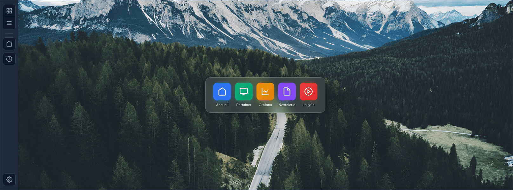
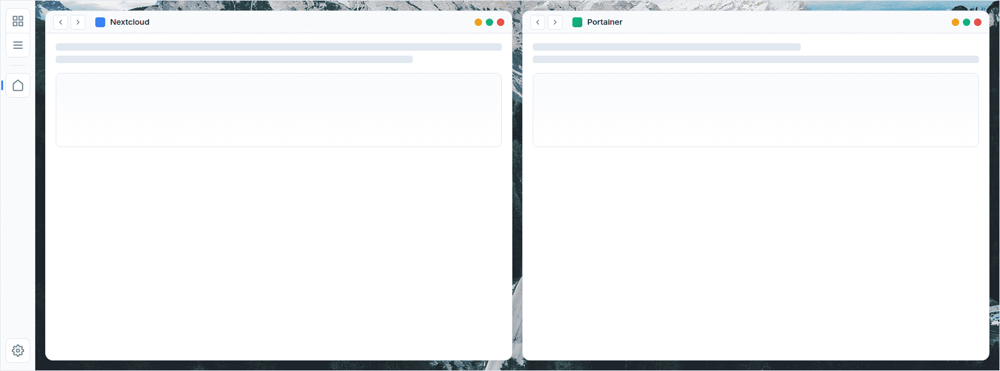
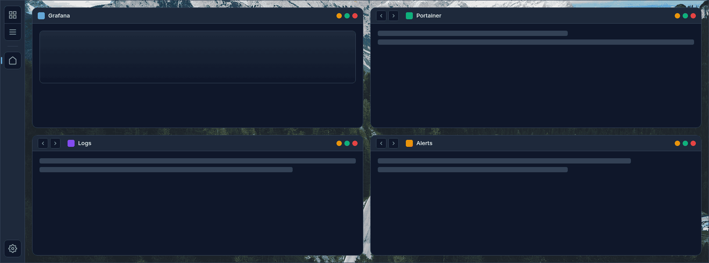
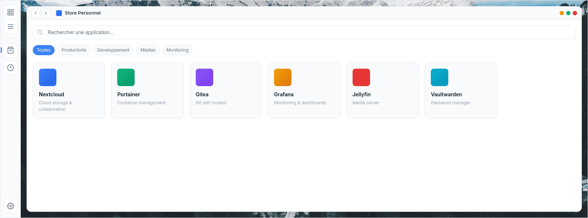
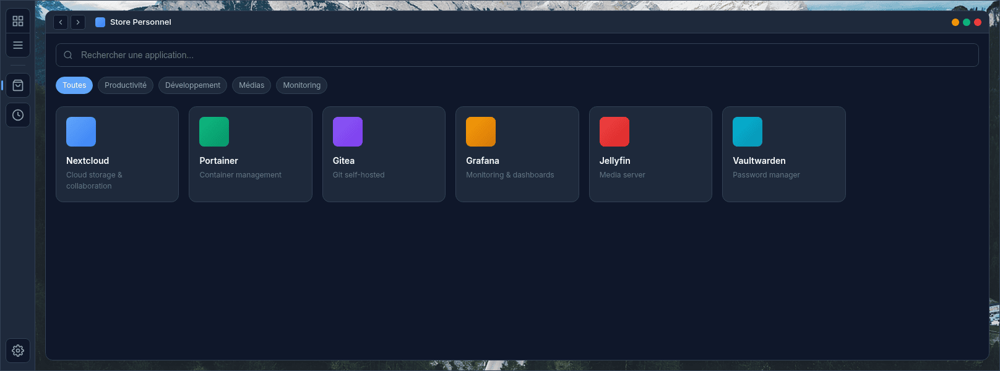
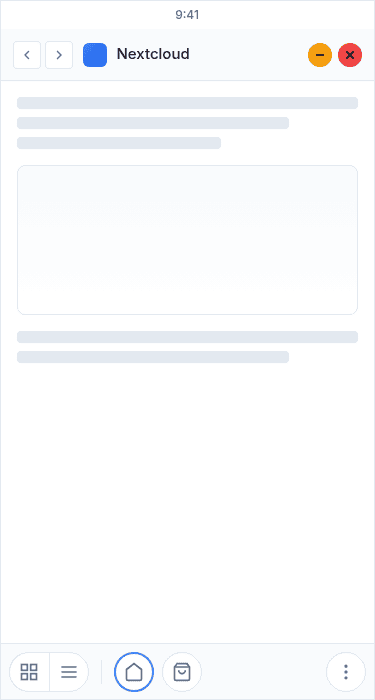
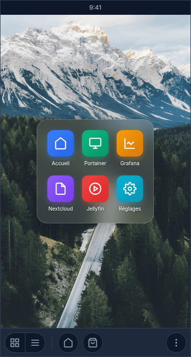

# UniDash

[](https://github.com/UniDash-Linux/UniDash/actions/workflows/ci-python.yml)
[](https://github.com/UniDash-Linux/UniDash/actions/workflows/ci-web.yml)
[](https://UniDash-Linux.github.io/UniDash/)
[](LICENSE)

UniDash is a self-hosted web desktop platform that provides a unified interface for managing and accessing multiple web applications through a single authentication system.

## UI Mockups

> **Note:** These are design mockups representing the planned interface, not the final implementation.

### Desktop Interface

| Light Mode | Dark Mode |
|------------|-----------|
|  |  |

### Tiling Window Management

| 2 Columns | 4 Quadrants |
|-----------|-------------|
|  |  |

### App Store

| Light Mode | Dark Mode |
|------------|-----------|
|  |  |

### Mobile Interface

| App View | Desktop View |
|----------|--------------|
|  |  |

### Installation Wizard


## Documentation

Full documentation is available at: **[UniDash Documentation](https://UniDash-Linux.github.io/UniDash/)**

- [Getting Started](https://UniDash-Linux.github.io/UniDash/getting-started/introduction/)
- [Architecture](https://UniDash-Linux.github.io/UniDash/architecture/overview/)
- [API Reference](https://UniDash-Linux.github.io/UniDash/api/overview/)
- [Deployment Guide](https://UniDash-Linux.github.io/UniDash/deployment/overview/)

## Quick Start

### Prerequisites

- Python 3.13+
- Node.js 20+
- Docker (for development containers)

### Development Setup

```bash
# Clone the repository
git clone https://github.com/UniDash-Linux/UniDash.git
cd UniDash

# Install Python dependencies
python -m venv .venv
source .venv/bin/activate
pip install -r requirements-dev.txt
pip install -e "api/shared[dev]" -e "api/db[dev]" -e "api/sso[dev]" \
            -e "api/unidash[dev]" -e "api/admin[dev]" -e "api/backup[dev]"

# Install frontend dependencies
cd web && npm install && cd ..

# Install documentation dependencies
cd docs && npm install && cd ..

# Run tests
pytest api/ --cov --cov-fail-under=100
cd web && npm run test:coverage
```

For detailed setup instructions, see the [Development Guide](https://UniDash-Linux.github.io/UniDash/development/setup/).

## Features

- **Web Desktop**: Browser-based desktop with windows, docks, and tiling
- **Single Sign-On**: Unified authentication (OIDC, LDAP, Proxy Auth)
- **App Store**: One-click installation of self-hosted applications
- **K3S Cluster**: High-availability Kubernetes deployment
- **VPN Access**: Secure L2TP/IPsec connectivity

## Project Structure

```text
UniDash/
├── api/                    # Backend Python packages (FastAPI)
│   ├── shared/             # Shared utilities (unidash_shared)
│   ├── db/                 # Database access (unidash_db)
│   ├── sso/                # Authentication (unidash_sso)
│   ├── unidash/            # Main API (unidash_api)
│   ├── admin/              # Admin API (unidash_admin)
│   └── backup/             # Backup API (unidash_backup)
├── web/                    # Frontend (Astro + React + Tailwind)
├── docs/                   # Documentation (Starlight)
├── infra/                  # Infrastructure (Ansible, K8S)
└── .github/                # GitHub Actions workflows
```

## Contributing

We welcome contributions! Please see our [Contributing Guide](CONTRIBUTING.md) for details.

Before contributing, please read our [Code of Conduct](CODE_OF_CONDUCT.md).

## License

This project is licensed under the GNU Lesser General Public License v2.1 - see the [LICENSE](LICENSE) file for details.

## Security

For security concerns, please see our [Security Policy](SECURITY.md).
