# Architecture Decision Document

_This document builds collaboratively through step-by-step discovery. Sections are appended as we work through each architectural decision together._

## Project Context Analysis

### Requirements Overview

**Functional Requirements:** 24 FRs organisés en 6 domaines :

| Domaine | FRs | Complexité |
|---------|-----|------------|
| Infrastructure & Installation | FR1-FR5 | High (K3S, VPN, Certs) |
| Auth & Users | FR6-FR11 | High (AD, SSO, Proxy Auth) |
| Store & Apps | FR12-FR19 | Medium (YAML, lifecycle) |
| Bureau Web | FR20-FR26 | High (iFrames, tiling, docks) |
| Permissions | FR27-FR29 | Low (3 niveaux MVP) |
| Admin Système | FR30-FR33 | Medium (logs, backup, kubectl) |

**Non-Functional Requirements:** Focus sur performance (< 2s charge bureau), sécurité (TLS, isolation namespaces), et haute disponibilité (K3S 3 nœuds, 95% uptime).

**Scale & Complexity:**

- Primary domain: Full-stack + Infrastructure
- Complexity level: HIGH
- Estimated architectural components: 8-10

### Technical Constraints & Dependencies

| Constraint | Value | Rationale |
|------------|-------|-----------|
| Backend | Python/FastAPI | Librairies AD/LDAP stables |
| Frontend | Astro | Performance, SSR, islands |
| Orchestration | K3S | HA native, standard enterprise |
| Database | PostgreSQL | Standard enterprise |
| VPN | L2TP/IPsec | Protocole enterprise éprouvé |
| Build Order | Infra → API → Desktop | Dépendances techniques |

### Cross-Cutting Concerns Identified

1. **Authentication & SSO** - UniDash comme provider OIDC, apps s'authentifient via protocole standard (redirections HTTP), session partagée via cookies same-origin ou tokens
2. **Proxy Auth pour apps legacy** - Pour les apps sans support OIDC, le reverse proxy injecte les headers d'authentification
3. **Security** - TLS everywhere, namespace isolation, session management
4. **State Management** - Bureau, fenêtres, préférences utilisateur (côté client)
5. **Observability** - Logs centralisés, health checks, monitoring
6. **Permissions** - Granularité bureau/store/apps

## Starter Template Evaluation

### Primary Technology Domain

Multi-composant : Infrastructure (Ansible/K3S natif) + API Backend (FastAPI) + Desktop Web (Astro) + Documentation (Starlight)

### Starter Options Considered

**Backend (FastAPI):** Structure custom basée sur FastAPI Best Practices - DDD
**Frontend (Astro):** Astro minimal + Tailwind + Headless UI + TypeScript + ESLint
**Documentation (Starlight):** Astro Starlight - déployé via GitHub Pages

### Selected Approach

**Initialization Commands:**

```bash
# Frontend Astro (Bureau Web)
npm create astro@latest web -- --template minimal --typescript strict
cd web && npx astro add tailwind
npm install @headlessui/react
npm install -D eslint @typescript-eslint/parser @typescript-eslint/eslint-plugin eslint-plugin-astro

# Documentation Starlight
npm create astro@latest docs -- --template starlight --typescript strict

# Backend FastAPI
mkdir -p api && cd api
python3.14 -m venv .venv
pip install fastapi uvicorn sqlalchemy alembic python-ldap authlib pydantic-settings
```

### Architectural Decisions

**Containerization Strategy:**

| Composant | Déploiement | Rationale |
|-----------|-------------|-----------|
| **infra/** | Natif sur hôte | Évite Docker-in-Docker, Ansible/K3S contrôlent l'hôte |
| **api/** | Dockerfile dédié | Service indépendant, peut survivre si web tombe |
| **web/** | Dockerfile dédié | Service indépendant, peut être redéployé sans affecter l'API |
| **docs/** | GitHub Pages | Static, sync GitHub Actions, pas besoin de runtime |

**Frontend (Astro - Bureau Web):**

| Decision | Value |
|----------|-------|
| Language | TypeScript (strict) |
| Styling | Tailwind CSS v4 |
| UI Components | Headless UI (accessible) |
| Linting | ESLint + @typescript-eslint + eslint-plugin-astro |
| Build | Astro 5 (Vite-based) |
| Container | Dockerfile dédié (nginx ou node) |

**Backend (FastAPI):**

| Decision | Value |
|----------|-------|
| Language | Python 3.14 (EOL Oct 2030) |
| Framework | FastAPI + Uvicorn |
| ORM | SQLAlchemy 2.0 + Alembic |
| Auth libs | python-ldap, authlib |
| Container | Dockerfile dédié (python:3.14-slim) |

**Documentation (Starlight):**

| Decision | Value |
|----------|-------|
| Framework | Astro Starlight |
| Déploiement | GitHub Pages via GitHub Actions |
| Sync | docs/ → GitHub Wiki (bidirectionnel) |

### Project Structure

```
unidash/
├── infra/                    # NATIF - Ansible playbooks + K3S manifests
│   ├── ansible/
│   │   ├── playbooks/
│   │   └── inventory/
│   └── k8s/
│       ├── manifests/
│       └── helm/
├── api/                      # CONTAINER 1 - FastAPI backend
│   ├── Dockerfile
│   ├── app/
│   │   ├── core/
│   │   ├── modules/
│   │   ├── models/
│   │   └── api/
│   └── tests/
├── web/                      # CONTAINER 2 - Astro frontend
│   ├── Dockerfile
│   ├── src/
│   │   ├── components/
│   │   ├── layouts/
│   │   └── pages/
│   ├── eslint.config.js
│   └── tsconfig.json
├── docs/                     # GITHUB PAGES - Starlight documentation
│   ├── src/
│   │   └── content/docs/
│   └── astro.config.mjs
└── .github/
    └── workflows/
        ├── docs-deploy.yml   # Deploy docs to GitHub Pages
        └── docs-wiki-sync.yml # Sync docs ↔ GitHub Wiki
```

### Resilience Design

```
┌─────────────────────────────────────────────────────────────┐
│                         HÔTE                                 │
│  ┌─────────────────────────────────────────────────────────┐│
│  │  INFRA NATIVE (Ansible + K3S)                           ││
│  │  - Contrôle direct de l'hôte                            ││
│  │  - Pas de Docker-in-Docker                              ││
│  └─────────────────────────────────────────────────────────┘│
│                                                              │
│  ┌─────────────────────┐    ┌─────────────────────┐        │
│  │  CONTAINER: API     │    │  CONTAINER: WEB     │        │
│  │  (FastAPI)          │    │  (Astro)            │        │
│  │                     │    │                     │        │
│  │  ✓ Indépendant      │    │  ✓ Indépendant      │        │
│  │  ✓ Restart isolé    │    │  ✓ Restart isolé    │        │
│  └─────────────────────┘    └─────────────────────┘        │
│           │                          │                      │
│           └──────────┬───────────────┘                      │
│                      ▼                                      │
│              Si WEB tombe → API continue                    │
│              Si API tombe → WEB affiche erreur gracieuse    │
└─────────────────────────────────────────────────────────────┘

┌─────────────────────────────────────────────────────────────┐
│                    GITHUB (externe)                          │
│  ┌─────────────────────┐    ┌─────────────────────┐        │
│  │  GitHub Pages       │◄──►│  GitHub Wiki        │        │
│  │  (Starlight docs)   │sync│  (markdown)         │        │
│  └─────────────────────┘    └─────────────────────┘        │
└─────────────────────────────────────────────────────────────┘
```

### Python Version Strategy

| Version | Status | Security Mode | EOL | Décision |
|---------|--------|---------------|-----|----------|
| 3.11 | Security | - | Oct 2027 | ❌ Trop court |
| 3.12 | Security | - | Oct 2028 | ❌ Risqué |
| 3.13 | Bugfix | Oct 2026 | Oct 2029 | ⚠️ Possible |
| **3.14** | **Bugfix** | **Oct 2027** | **Oct 2030** | ✅ **Retenu** |

**Rationale:** Python 3.14 offre ~5 ans avant EOL, permettant de développer MVP → V2 → V3 confortablement, puis planifier une migration vers 3.17+ ou 4.x avec plus de moyens en V4/V5.

## Core Architectural Decisions

### Data Architecture

| Décision | Choix | Rationale |
|----------|-------|-----------|
| **Architecture API** | API-DB dédiée + APIs métier séparées | Scalabilité, isolation des pannes |
| **Communication inter-API** | REST (HTTP interne) | Simple, suffisant en loopback |
| **Exposition API-DB** | ClusterIP uniquement (réseau K3S interne) | Sécurité maximale |
| **PostgreSQL HA** | Patroni + etcd (3 nœuds) | Battle-tested, failover auto |
| **Data Access Pattern** | Repository + Unit of Work | Découplage, testabilité |
| **Validation** | SQLAlchemy constraints (primary) + Pydantic (fallback) | Proche DB |
| **Cache** | Redis (ClusterIP interne) | Standard, performant |
| **Connection Pooling** | SQLAlchemy intégré | Gestion connexions multi-replica |

**Data Modeling Approach:** MCD → MLD → SQL + UML

**Testing Strategy:**
- Backend: pytest
- Frontend: Vitest + Playwright
- Coverage: 100% blocking in CI
- Types: Unit + Integration + E2E

### Authentication & Security

| Décision | Choix | Rationale |
|----------|-------|-----------|
| **OIDC Provider** | Authlib | Déjà intégré, mature |
| **Sessions** | Redis (serveur-side) | Révocation immédiate, sécurité enterprise |
| **Tokens** | Sessions stateful (pas JWT) | Contrôle total, révocation instantanée |
| **Chiffrement données** | python-cryptography | Clés jamais en DB, pas de fuite logs |
| **Proxy Auth** | Headers injectés par reverse proxy | Apps legacy sans OIDC |

**API SSO - Dépendances techniques :**

| Fonctionnalité | Librairie | Version | Rationale |
|----------------|-----------|---------|-----------|
| **OIDC Provider** | Authlib | latest | Provider OIDC complet, endpoints standard |
| **LDAP Client** | python-ldap | latest | Connexion AD/LDAP native, bind, search |
| **Sessions Redis** | redis-py + hiredis | latest | Sessions server-side avec performance |
| **Password Hashing** | argon2-cffi | latest | Algorithme recommandé (bcrypt acceptable) |
| **JWT (tokens OIDC)** | PyJWT | latest | Tokens signés pour OIDC (pas pour sessions) |
| **Cryptographie** | python-cryptography | latest | Chiffrement secrets en DB |

**Responsabilités API SSO :**

```
┌─────────────────────────────────────────────────────────────────────────┐
│                        API SSO (unidash_sso)                             │
├─────────────────────────────────────────────────────────────────────────┤
│                                                                           │
│  ENDPOINTS PUBLICS :                                                     │
│  ├── POST /auth/login           → Login natif/AD                         │
│  ├── POST /auth/logout          → Révocation session                     │
│  ├── GET  /auth/me              → User info (session valide)             │
│  ├── GET  /.well-known/openid   → OIDC Discovery                         │
│  ├── GET  /oauth/authorize      → OIDC Authorization                     │
│  ├── POST /oauth/token          → OIDC Token                             │
│  └── GET  /oauth/userinfo       → OIDC UserInfo                          │
│                                                                           │
│  SERVICES INTERNES :                                                     │
│  ├── SessionService             → Création/validation/révocation Redis   │
│  ├── OIDCProviderService        → UniDash comme provider OIDC            │
│  ├── LDAPService                → Connexion AD, sync users               │
│  ├── AuthCascadeService         → OIDC > LDAP > ProxyAuth pour apps      │
│  └── ProxyAuthService           → Config headers pour HAProxy            │
│                                                                           │
│  CONSOMME :                                                              │
│  ├── Redis                      → Sessions (lecture/écriture)            │
│  └── API-DB                     → Users, apps, permissions               │
│                                                                           │
└─────────────────────────────────────────────────────────────────────────┘
```

### API & Communication

| Décision | Choix | Rationale |
|----------|-------|-----------|
| **Exposition UniDash** | Internet (homelab) OU VPN User (enterprise) | Flexibilité déploiement |
| **Exposition Admin** | VPN Admin uniquement | Sécurité admin ops |
| **Exposition DB** | ClusterIP K3S interne | Jamais exposée |
| **Format réponses** | JSON:API | Standard, open source friendly, évite duplicatas |
| **Versioning** | URL path (`/v1/`) | Simple, visible |
| **Documentation** | OpenAPI/Swagger (FastAPI natif) | Auto-généré |
| **Rate limiting** | Redis, global + per-endpoint + admin boost (+50%) | Flexibilité |
| **Errors public** | Messages génériques + request_id | Sécurité |
| **Errors admin** | RFC 7807 + stack trace | Debug facilité (VPN Admin + compte admin + mode admin) |

**Modes de déploiement :**
- **Homelab (défaut):** Internet → Web + API UniDash, VPN Admin → API Admin
- **Enterprise:** VPN User → Web + API UniDash, VPN Admin → API Admin, Internet → RIEN

**Project Structure (mise à jour) :**

```
unidash/
├── api/                      # Toutes les APIs
│   ├── db/                   # API-DB (ClusterIP interne)
│   │   ├── Dockerfile
│   │   ├── app/
│   │   └── tests/
│   ├── sso/                  # API SSO (Internet/VPN User - même exposition qu'api/unidash)
│   │   ├── Dockerfile
│   │   ├── app/
│   │   └── tests/
│   ├── unidash/              # API UniDash (Internet/VPN User)
│   │   ├── Dockerfile
│   │   ├── app/
│   │   └── tests/
│   ├── admin/                # API Admin (VPN Admin only)
│   │   ├── Dockerfile
│   │   ├── app/
│   │   └── tests/
│   └── backup/               # API Backup (ClusterIP interne)
│       ├── Dockerfile
│       ├── app/
│       └── tests/
├── web/                      # Frontend Astro
├── infra/                    # Ansible + K3S (natif)
├── docs/                     # Starlight → GitHub Pages
└── .github/workflows/
```

**Architecture API SSO séparée (résilience maximale) :**

```
┌─────────────────────────────────────────────────────────────────────────┐
│                    ARCHITECTURE AUTHENTIFICATION                          │
├─────────────────────────────────────────────────────────────────────────┤
│                                                                           │
│  Internet/VPN User ──────┬──────────────┬──────────────────────────────  │
│                          │              │                                 │
│                          ▼              ▼                                 │
│                   ┌─────────────┐ ┌─────────────┐                        │
│                   │  API SSO    │ │ API UniDash │                        │
│                   │  (auth)     │ │  (métier)   │                        │
│                   │             │ │             │                        │
│                   │  - Sessions │ │  - Desktop  │                        │
│                   │  - OIDC     │ │  - Store    │                        │
│                   │  - LDAP cfg │ │  - Apps     │                        │
│                   │  - ProxyAuth│ │             │                        │
│                   └──────┬──────┘ └──────┬──────┘                        │
│                          │               │                                │
│                          │               │                                │
│                          ▼               ▼                                │
│                   ┌─────────────┐ ┌─────────────┐                        │
│                   │   Redis     │ │   API-DB    │◄───────┘               │
│                   │  (sessions) │ │             │                        │
│                   └─────────────┘ └──────┬──────┘                        │
│                                          │                                │
│                          ┌───────────────┘                                │
│                          ▼                                                │
│                   API SSO consomme aussi API-DB pour :                   │
│                   - Lier users aux apps (permissions)                    │
│                   - Config auth apps (OIDC/LDAP/Proxy)                   │
│                   - Pas d'action manuelle requise                        │
│                                                                           │
│  AVANTAGES :                                                             │
│  ✓ API SSO et API UniDash sont INDÉPENDANTES (pas de dépendance)        │
│  ✓ Si API UniDash tombe → Auth + Apps installées continuent             │
│  ✓ Si API SSO tombe → Sessions existantes valides (Redis)               │
│  ✓ Frontend appelle directement l'API appropriée                        │
│  ✓ Scaling indépendant de chaque service                                │
└─────────────────────────────────────────────────────────────────────────┘
```

**Cascade d'authentification des applications :**

```
┌─────────────────────────────────────────────────────────────────────────┐
│            STRATÉGIE AUTH PAR APPLICATION (cascade)                       │
├─────────────────────────────────────────────────────────────────────────┤
│                                                                           │
│  ┌─────────────────┐                                                     │
│  │ App installée   │                                                     │
│  └────────┬────────┘                                                     │
│           │                                                              │
│           ▼                                                              │
│  ┌─────────────────┐    OUI    ┌─────────────────────────┐              │
│  │ App supporte    │──────────►│ SSO OIDC natif           │              │
│  │ OIDC ?          │           │ → Auto-config provider   │              │
│  └────────┬────────┘           │ → Zéro intervention      │              │
│           │ NON                └─────────────────────────┘              │
│           ▼                                                              │
│  ┌─────────────────┐    OUI    ┌─────────────────────────┐              │
│  │ App supporte    │──────────►│ LDAP/AD natif            │              │
│  │ LDAP ?          │           │ → Config LDAP vers AD    │              │
│  └────────┬────────┘           │ → Comptes synchronisés   │              │
│           │ NON                └─────────────────────────┘              │
│           ▼                                                              │
│  ┌─────────────────┐           ┌─────────────────────────┐              │
│  │ Fallback        │──────────►│ Proxy Auth (headers)     │              │
│  │ Proxy Auth      │           │ → HAProxy injecte headers│              │
│  └─────────────────┘           │ → X-Forwarded-User, etc. │              │
│                                └─────────────────────────┘              │
└─────────────────────────────────────────────────────────────────────────┘
```

### Frontend Architecture

| Décision | Choix | Rationale |
|----------|-------|-----------|
| **State Management** | Nanostores | Astro-native, léger (1KB), simple pour contributeurs |
| **Framework UI** | React | Headless UI natif, écosystème massif |
| **Data Fetching** | TanStack Query | Standard, cache, retry, JSON:API ready |
| **Routing** | File-based + View Transitions | Natif Astro, transitions fluides |
| **Animations** | CSS + Framer Motion | CSS simple, Framer pour tiling/fenêtres |
| **Architecture** | SPA-like Islands | Toutes pages en React islands avec client:load |

**Architecture SPA-like Islands :**
- **Toutes les pages** utilisent des islands React avec `client:load`
- Navigation fluide via View Transitions API (Astro 5)
- State partagé via Nanostores entre toutes les pages
- **Avantage:** Expérience SPA cohérente, transitions fluides, state persistant

### Infrastructure & Deployment

| Décision | Choix | Rationale |
|----------|-------|-----------|
| **Reverse Proxy HTTP/TCP** | HAProxy | Performance, health checks gratuits, standard enterprise |
| **Reverse Proxy UDP** | Nginx (stream) | HAProxy ne supporte pas UDP |
| **TLS MVP (K3S)** | cert-manager (Let's Encrypt) | Natif K8S, automatisé |
| **TLS futur (Proxmox, Docker, legacy)** | Certbot | Standard, CLI, tout service TLS |
| **Container Registry** | GitHub Container Registry | Intégré GitHub Actions, open source |
| **CI/CD** | GitHub Actions | Gratuit open source, suffisant MVP |
| **Branching** | GitFlow | main/develop + feature/release/hotfix branches |
| **Commits** | Conventional Commits | feat/fix/docs/style/refactor/test/chore |
| **Monitoring** | Prometheus + Grafana | Standard, intégration native K8S |
| **Logs** | Loki (stack Grafana) | Interface unifiée avec Grafana |

**Backup Architecture (future-proof dès V1) :**

```
┌─────────────────────────────────────────────────────────────────────────┐
│                 UNIDASH BACKUP SERVICE (Abstraction Layer)               │
├─────────────────────────────────────────────────────────────────────────┤
│  API unifiée : /api/v1/backups                                          │
│  ├── trigger_backup(service_type, target)                               │
│  ├── list_backups(service_type)                                         │
│  ├── restore(backup_id)                                                 │
│  └── configure_schedule(service_type, cron)                             │
├─────────────────────────────────────────────────────────────────────────┤
│  BACKENDS (plugins) :                                                   │
│  ├── VeleroBackend (K3S) → V1                                           │
│  ├── PBSBackend (Proxmox) → V2+                                         │
│  ├── DockerBackend (Docker) → V2+                                       │
│  └── GenericBackend (scripts custom) → V2+                              │
├─────────────────────────────────────────────────────────────────────────┤
│  STORAGE (configurable) :                                               │
│  ├── Local (disque serveur)                                             │
│  ├── NFS/SMB (NAS)                                                      │
│  ├── S3-compatible (MinIO, Backblaze, AWS)                              │
│  └── PBS datastore                                                      │
└─────────────────────────────────────────────────────────────────────────┘
```

**PBS Cross-site (V2+ Proxmox) :**
- 3 serveurs = 3 PBS instances
- Chaque PBS réplique vers les 2 autres
- Résultat : 3 copies de tout (règle 3-2-1)

**Certificats TLS - Stratégie multi-service :**

| Service | Solution TLS | Rationale |
|---------|--------------|-----------|
| K3S services | cert-manager | Natif K8S |
| Proxmox UI/API | Certbot | Plus flexible que ACME natif (limité à UI) |
| Docker services | Certbot | Standard |
| Services legacy | Certbot | Pas de self-signed |
| PostgreSQL TLS | Certbot | Certificats X.509 standard |

## Implementation Patterns & Consistency Rules

### Naming Patterns

**Database Naming:**

| Élément | Convention | Exemple |
|---------|------------|---------|
| Tables | snake_case pluriel | `users`, `app_instances` |
| Colonnes | snake_case | `user_id`, `created_at` |
| Foreign Keys | `fk_<column>` | `fk_user_id` |
| Index | `idx_<table>_<columns>` | `idx_users_email` |

**API Naming:**

| Élément | Convention | Exemple |
|---------|------------|---------|
| Endpoints | pluriel | `/users`, `/apps` |
| Route params | `{param}` | `/users/{id}` |
| Query params | snake_case | `?user_id=1&sort_by=name` |

**Code Naming:**

| Domaine | Convention | Exemple |
|---------|------------|---------|
| Python fonctions | snake_case | `get_user_data()` |
| Python fichiers | snake_case | `user_service.py` |
| Python classes | PascalCase | `UserRepository` |
| Python packages | snake_case avec prefix | `unidash_db`, `unidash_api` |
| TypeScript vars/funcs | camelCase | `getUserData`, `userId` |
| React Components | PascalCase | `WindowManager.tsx` |

### Structure Patterns

**Python (src layout PyPA standard):**

```
api/<service>/
├── Dockerfile
├── pyproject.toml
├── src/
│   └── unidash_<service>/
│       ├── __init__.py
│       ├── core/
│       ├── models/
│       ├── repositories/
│       ├── services/
│       └── api/
└── tests/
    └── unidash_<service>/
```

**Python Packages:**

| API | Package | Import |
|-----|---------|--------|
| api/shared | `unidash_shared` | `from unidash_shared.types import ...` |
| api/db | `unidash_db` | `from unidash_db.models import User` |
| api/sso | `unidash_sso` | `from unidash_sso.providers import ...` |
| api/unidash | `unidash_api` | `from unidash_api.services import ...` |
| api/admin | `unidash_admin` | `from unidash_admin.api import ...` |
| api/backup | `unidash_backup` | `from unidash_backup.backends import ...` |

**Frontend Astro:**

```
web/
├── src/
│   ├── pages/              # Routing Astro (obligatoire)
│   ├── features/           # Organisation par feature
│   │   ├── desktop/
│   │   │   ├── components/
│   │   │   ├── hooks/
│   │   │   └── stores/
│   │   ├── store/
│   │   └── auth/
│   ├── shared/             # Composants cross-feature
│   └── lib/                # Utilitaires purs
└── tests/                  # Structure miroir
    ├── features/
    └── shared/
```

### Format Patterns

| Élément | Convention |
|---------|------------|
| JSON field naming | snake_case |
| Dates | ISO 8601 (`2026-01-10T14:30:00Z`) |
| Null fields | Omettre |
| Empty arrays | `[]` (explicite) |
| Booleans | `true/false` |

### Communication Patterns

| Domaine | Convention | Exemple |
|---------|------------|---------|
| Events | `domain.action` | `user.created` |
| Event payload | Flat | `{user_id, email}` |
| Nanostores | `$` prefix | `$userStore` |
| Actions | `domain.verb` | `user.set` |
| Logs | Structured JSON | Parseable Loki |
| Log levels | DEBUG/INFO/WARN/ERROR | Standard |

### Process Patterns

| Domaine | Convention |
|---------|------------|
| Error boundary | Global + par feature critique |
| Loading state | TanStack Query (per-query) |
| Retry strategy | TanStack Query auto |
| Validation | Client-side first, server valide toujours |
| Notifications | Store centralisé `$notifications` |

### Enforcement Guidelines

**All AI Agents MUST:**
- Utiliser `src/` layout pour tous les packages Python
- Préfixer les packages Python avec `unidash_`
- Placer les tests dans `tests/` avec structure miroir
- Utiliser JSON:API format pour toutes les réponses
- Logger en JSON structuré

**Pattern Verification:**
- ESLint + Prettier (frontend)
- Ruff + Black (backend)
- CI bloque si patterns non respectés

## Project Structure & Boundaries

### Complete Project Directory Structure

```
unidash/
├── README.md
├── LICENSE
├── .gitignore
├── .editorconfig
├── .github/
│   └── workflows/
│       ├── ci.yml                    # Tests + lint + build
│       ├── docs-deploy.yml           # Deploy Starlight → GitHub Pages
│       └── docs-wiki-sync.yml        # Sync docs ↔ GitHub Wiki
│
├── api/                              # PYTHON APIS (src layout)
│   ├── shared/                       # Librairie commune
│   │   ├── pyproject.toml
│   │   ├── src/
│   │   │   └── unidash_shared/
│   │   │       ├── __init__.py
│   │   │       ├── types/
│   │   │       │   └── __init__.py
│   │   │       ├── exceptions/
│   │   │       │   └── __init__.py
│   │   │       └── utils/
│   │   │           └── __init__.py
│   │   └── tests/
│   │       └── unidash_shared/
│   │
│   ├── db/                           # API-DB (ClusterIP interne)
│   │   ├── Dockerfile
│   │   ├── pyproject.toml
│   │   ├── alembic.ini
│   │   ├── src/
│   │   │   └── unidash_db/
│   │   │       ├── __init__.py
│   │   │       ├── core/
│   │   │       │   ├── __init__.py
│   │   │       │   ├── config.py
│   │   │       │   └── database.py
│   │   │       ├── models/
│   │   │       │   ├── __init__.py
│   │   │       │   ├── user.py
│   │   │       │   └── app.py
│   │   │       ├── repositories/
│   │   │       │   ├── __init__.py
│   │   │       │   └── base.py
│   │   │       ├── services/
│   │   │       │   └── __init__.py
│   │   │       └── api/
│   │   │           ├── __init__.py
│   │   │           ├── main.py
│   │   │           └── routes/
│   │   │               └── __init__.py
│   │   ├── migrations/
│   │   │   └── versions/
│   │   └── tests/
│   │       └── unidash_db/
│   │
│   ├── sso/                          # API SSO (Internet/VPN User - même exposition qu'api/unidash)
│   │   ├── Dockerfile
│   │   ├── pyproject.toml
│   │   ├── src/
│   │   │   └── unidash_sso/
│   │   │       ├── __init__.py
│   │   │       ├── core/
│   │   │       ├── providers/
│   │   │       │   ├── __init__.py
│   │   │       │   ├── oidc.py
│   │   │       │   ├── ldap.py
│   │   │       │   └── proxy_auth.py
│   │   │       ├── services/
│   │   │       │   ├── __init__.py
│   │   │       │   ├── session.py
│   │   │       │   └── auth_cascade.py
│   │   │       └── api/
│   │   │           ├── main.py
│   │   │           └── routes/
│   │   │               ├── auth.py
│   │   │               ├── sessions.py
│   │   │               └── oidc_provider.py
│   │   └── tests/
│   │       └── unidash_sso/
│   │
│   ├── unidash/                      # API UniDash (Internet/VPN User)
│   │   ├── Dockerfile
│   │   ├── pyproject.toml
│   │   ├── src/
│   │   │   └── unidash_api/
│   │   │       ├── __init__.py
│   │   │       ├── core/
│   │   │       ├── services/
│   │   │       └── api/
│   │   │           ├── main.py
│   │   │           └── routes/
│   │   │               ├── users.py
│   │   │               ├── apps.py
│   │   │               └── desktop.py
│   │   └── tests/
│   │       └── unidash_api/
│   │
│   ├── admin/                        # API Admin (VPN Admin only)
│       ├── Dockerfile
│       ├── pyproject.toml
│       ├── src/
│       │   └── unidash_admin/
│       │       ├── __init__.py
│       │       ├── core/
│       │       ├── services/
│       │       └── api/
│       │           ├── main.py
│       │           └── routes/
│       │               ├── system.py
│       │               ├── logs.py
│       │               └── backups.py
│       └── tests/
│           └── unidash_admin/
│
│   └── backup/                       # API Backup (ClusterIP interne)
│       ├── Dockerfile
│       ├── pyproject.toml
│       ├── src/
│       │   └── unidash_backup/
│       │       ├── __init__.py
│       │       ├── core/
│       │       ├── backends/
│       │       │   ├── __init__.py
│       │       │   ├── velero.py
│       │       │   └── base.py
│       │       ├── services/
│       │       │   └── __init__.py
│       │       └── api/
│       │           ├── main.py
│       │           └── routes/
│       │               └── backups.py
│       └── tests/
│           └── unidash_backup/
│
├── web/                              # FRONTEND ASTRO
│   ├── Dockerfile
│   ├── package.json
│   ├── astro.config.mjs
│   ├── tailwind.config.js
│   ├── tsconfig.json
│   ├── eslint.config.js
│   ├── .env.example
│   ├── src/
│   │   ├── env.d.ts
│   │   ├── pages/
│   │   │   ├── index.astro
│   │   │   ├── login.astro
│   │   │   ├── desktop.astro
│   │   │   ├── store/
│   │   │   │   ├── index.astro
│   │   │   │   └── [appId].astro
│   │   │   ├── settings.astro
│   │   │   └── admin/
│   │   │       ├── index.astro
│   │   │       ├── users.astro
│   │   │       ├── logs.astro
│   │   │       └── backups.astro
│   │   ├── layouts/
│   │   │   ├── BaseLayout.astro
│   │   │   └── AdminLayout.astro
│   │   ├── features/
│   │   │   ├── desktop/
│   │   │   │   ├── components/
│   │   │   │   │   ├── Desktop.tsx
│   │   │   │   │   ├── WindowManager.tsx
│   │   │   │   │   ├── Window.tsx
│   │   │   │   │   ├── Taskbar.tsx
│   │   │   │   │   └── Dock.tsx
│   │   │   │   ├── hooks/
│   │   │   │   │   └── useWindow.ts
│   │   │   │   └── stores/
│   │   │   │       ├── $desktopState.ts
│   │   │   │       └── $windowsState.ts
│   │   │   ├── store/
│   │   │   │   ├── components/
│   │   │   │   │   ├── AppCard.tsx
│   │   │   │   │   └── AppGrid.tsx
│   │   │   │   └── hooks/
│   │   │   │       └── useApps.ts
│   │   │   └── auth/
│   │   │       ├── components/
│   │   │       │   ├── LoginForm.tsx
│   │   │       │   └── LogoutButton.tsx
│   │   │       ├── hooks/
│   │   │       │   └── useAuth.ts
│   │   │       └── stores/
│   │   │           └── $authState.ts
│   │   ├── shared/
│   │   │   ├── components/
│   │   │   │   ├── Button.tsx
│   │   │   │   ├── Modal.tsx
│   │   │   │   ├── Toast.tsx
│   │   │   │   └── Loading.tsx
│   │   │   └── hooks/
│   │   │       └── useApi.ts
│   │   ├── lib/
│   │   │   ├── api.ts
│   │   │   ├── auth.ts
│   │   │   └── utils.ts
│   │   └── stores/
│   │       └── $notifications.ts
│   ├── tests/
│   │   ├── features/
│   │   │   ├── desktop/
│   │   │   ├── store/
│   │   │   └── auth/
│   │   └── shared/
│   └── public/
│       ├── favicon.svg
│       └── assets/
│
├── docs/                             # DOCUMENTATION STARLIGHT
│   ├── package.json
│   ├── astro.config.mjs
│   └── src/
│       └── content/
│           └── docs/
│               ├── index.md
│               ├── getting-started/
│               ├── architecture/
│               ├── api/
│               └── deployment/
│
└── infra/                            # INFRASTRUCTURE (natif)
    ├── ansible/
    │   ├── ansible.cfg
    │   ├── inventory/
    │   │   ├── production.yml
    │   │   └── staging.yml
    │   └── playbooks/
    │       ├── k3s-install.yml
    │       ├── vpn-setup.yml
    │       └── certificates.yml
    └── k8s/
        ├── manifests/
        │   ├── namespaces.yml
        │   ├── api-db.yml
        │   ├── api-sso.yml
        │   ├── api-unidash.yml
        │   ├── api-admin.yml
        │   ├── api-backup.yml
        │   ├── web.yml
        │   ├── postgres.yml
        │   ├── redis.yml
        │   └── haproxy.yml
        └── helm/
            └── unidash/
                ├── Chart.yaml
                ├── values.yaml
                └── templates/
```

### Requirements to Structure Mapping

| Domaine FR | APIs | Frontend | Infra |
|------------|------|----------|-------|
| **Infrastructure (FR1-5)** | - | - | `infra/ansible/`, `infra/k8s/` |
| **Auth & Users (FR6-12)** | `api/sso/routes/`, `api/db/models/user.py` | `web/src/features/auth/` | - |
| **Store & Apps (FR13-20)** | `api/unidash/routes/apps.py`, `api/db/models/app.py` | `web/src/features/store/` | - |
| **Bureau Web (FR21-27)** | `api/unidash/routes/desktop.py` | `web/src/features/desktop/` | - |
| **Permissions (FR28-30)** | `api/shared/`, `api/sso/`, `api/unidash/` | `web/src/features/auth/` | - |
| **Admin Systeme (FR31-34)** | `api/admin/routes/` | `web/src/pages/admin/` | - |

### Architectural Boundaries

**API Boundaries:**

| API | Exposition | Port | Acces |
|-----|------------|------|-------|
| `api/db` | ClusterIP interne | 8000 | APIs internes uniquement |
| `api/sso` | Internet/VPN User | 8001 | Utilisateurs + Apps (OIDC provider) |
| `api/unidash` | Internet/VPN User | 8002 | Utilisateurs authentifies |
| `api/admin` | VPN Admin | 8003 | Admins sur VPN uniquement |
| `api/backup` | ClusterIP interne | 8004 | APIs internes uniquement |

**Data Flow:**

```
┌─────────┐     ┌──────────────┐     ┌─────────┐     ┌────────────┐
│   Web   │────▶│ API UniDash  │────▶│ API-DB  │────▶│ PostgreSQL │
└─────────┘     └──────────────┘     └─────────┘     └────────────┘
                       │                   │
                       ▼                   ▼
                 ┌─────────┐         ┌─────────┐
                 │  Redis  │         │  Redis  │
                 │(sessions)│        │ (cache) │
                 └─────────┘         └─────────┘
```

**Component Communication:**

| Source | Target | Protocol | Pattern |
|--------|--------|----------|---------|
| Web → API UniDash | HTTPS | REST JSON:API |
| API UniDash → API-DB | HTTP (interne) | REST JSON:API |
| API Admin → API-DB | HTTP (interne) | REST JSON:API |
| APIs → Redis | TCP | Sessions/Cache |
| APIs → PostgreSQL | TCP/TLS | SQLAlchemy |

## Data Model (MCD/MLD)

### MCD - Diagramme Entité-Relation

```mermaid
erDiagram
    %% ==========================================
    %% AUTH & USERS (FR6-11, FR27-29)
    %% ==========================================

    auth_sources {
        int id PK
        varchar type "native|ad|oidc"
        varchar name
        jsonb config
        boolean is_active
        timestamptz created_at
        timestamptz updated_at
    }

    users {
        int id PK
        varchar username UK
        varchar email
        varchar password_hash "NULL si AD/OIDC"
        int fk_auth_source FK
        varchar external_id "ID dans AD/OIDC"
        varchar role "super_admin|admin|user"
        boolean is_active
        timestamptz last_login_at
        timestamptz created_at
        timestamptz updated_at
    }

    sessions {
        int id PK
        int fk_user FK
        varchar token_hash UK
        inet ip_address
        text user_agent
        timestamptz created_at
        timestamptz expires_at
        timestamptz revoked_at "NULL = active"
    }

    %% ==========================================
    %% APPLICATIONS & STORE (FR12-19)
    %% ==========================================

    app_definitions {
        int id PK
        varchar slug UK "nextcloud, plex"
        varchar name
        text description
        varchar version
        varchar category
        varchar icon_url
        text yaml_config
        boolean supports_oidc
        boolean supports_proxy_auth
        jsonb min_resources
        boolean is_official
        boolean is_active
        timestamptz created_at
        timestamptz updated_at
    }

    app_instances {
        int id PK
        int fk_app_def FK
        int fk_installed_by FK
        varchar namespace UK "K8S namespace"
        varchar status "pending|installing|running|stopped|error"
        jsonb config_override
        varchar internal_url
        varchar external_url
        timestamptz installed_at
        timestamptz updated_at
    }

    user_app_access {
        int id PK
        int fk_user FK
        int fk_app_instance FK
        boolean can_use
        boolean can_admin
        timestamptz added_at
        int added_by FK
    }

    %% ==========================================
    %% DESKTOP WEB (FR20-26)
    %% ==========================================

    desktops {
        int id PK
        int fk_user FK,UK
        varchar wallpaper
        varchar theme
        jsonb layout_config
        timestamptz created_at
        timestamptz updated_at
    }

    desktop_windows {
        int id PK
        int fk_desktop FK
        int fk_app_instance FK
        int position_x
        int position_y
        int width
        int height
        int z_index
        boolean is_minimized
        boolean is_maximized
        timestamptz created_at
        timestamptz updated_at
    }

    docks {
        int id PK
        int fk_desktop FK
        varchar name
        varchar position "top|bottom|left|right"
        varchar icon
        boolean is_visible
        int sort_order
        timestamptz created_at
    }

    dock_items {
        int id PK
        int fk_dock FK
        int fk_app_instance FK
        int position
    }

    shortcuts {
        int id PK
        int fk_desktop FK
        int fk_app_instance FK
        int position_x
        int position_y
        varchar icon_custom
        varchar label_custom
        timestamptz created_at
    }

    %% ==========================================
    %% INFRASTRUCTURE (FR1-5, FR30-33)
    %% ==========================================

    clusters {
        int id PK
        varchar name UK
        varchar k3s_version
        varchar status "initializing|healthy|degraded|error"
        jsonb config
        timestamptz created_at
        timestamptz updated_at
    }

    nodes {
        int id PK
        int fk_cluster FK
        varchar hostname
        inet ip_address
        varchar role "server|agent"
        varchar status "pending|ready|not_ready|error"
        jsonb resources
        timestamptz joined_at
        timestamptz last_heartbeat
        timestamptz created_at
    }

    backups {
        int id PK
        int fk_cluster FK
        varchar type "full|incremental|app"
        int fk_app_instance FK "NULL si backup cluster"
        varchar status "pending|running|completed|failed"
        bigint size_bytes
        varchar storage_path
        timestamptz started_at
        timestamptz completed_at
        timestamptz created_at
    }

    %% ==========================================
    %% AUDIT & VPN
    %% ==========================================

    audit_logs {
        int id PK
        int fk_user FK "NULL pour actions systeme"
        varchar action
        varchar resource_type
        int resource_id
        jsonb details
        inet ip_address
        text user_agent
        timestamptz created_at
    }

    vpn_configs {
        int id PK
        int fk_user FK "NULL = config globale"
        text psk_encrypted
        boolean is_active
        timestamptz created_at
    }

    %% ==========================================
    %% RELATIONS
    %% ==========================================

    auth_sources ||--o{ users : "authentifie"
    users ||--o{ sessions : "a"
    users ||--|| desktops : "possede"
    users ||--o{ user_app_access : "a acces"
    users ||--o{ audit_logs : "genere"
    users ||--o{ vpn_configs : "configure"
    users ||--o{ app_instances : "installe"

    app_definitions ||--o{ app_instances : "instancie"
    app_instances ||--o{ user_app_access : "accessible via"
    app_instances ||--o{ desktop_windows : "affiche dans"
    app_instances ||--o{ dock_items : "present dans"
    app_instances ||--o{ shortcuts : "raccourci vers"
    app_instances ||--o{ backups : "sauvegarde"

    desktops ||--o{ desktop_windows : "contient"
    desktops ||--o{ docks : "organise"
    desktops ||--o{ shortcuts : "affiche"

    docks ||--o{ dock_items : "contient"

    clusters ||--o{ nodes : "compose de"
    clusters ||--o{ backups : "sauvegarde"
```



### MLD - Schéma Relationnel SQL

```sql
-- ============================================
-- AUTH & USERS (FR6-11, FR27-29)
-- ============================================

CREATE TABLE auth_sources (
    id              SERIAL PRIMARY KEY,
    type            VARCHAR(20) NOT NULL CHECK (type IN ('native', 'ad', 'oidc')),
    name            VARCHAR(100) NOT NULL,
    config          JSONB NOT NULL DEFAULT '{}',
    is_active       BOOLEAN NOT NULL DEFAULT true,
    created_at      TIMESTAMPTZ NOT NULL DEFAULT NOW(),
    updated_at      TIMESTAMPTZ NOT NULL DEFAULT NOW()
);
CREATE INDEX idx_auth_sources_type ON auth_sources(type);

CREATE TABLE users (
    id              SERIAL PRIMARY KEY,
    username        VARCHAR(100) NOT NULL UNIQUE,
    email           VARCHAR(255),
    password_hash   VARCHAR(255),                    -- NULL si AD/OIDC
    fk_auth_source  INTEGER NOT NULL REFERENCES auth_sources(id),
    external_id     VARCHAR(255),                    -- ID dans AD/OIDC
    role            VARCHAR(20) NOT NULL DEFAULT 'user'
                    CHECK (role IN ('super_admin', 'admin', 'user')),
    is_active       BOOLEAN NOT NULL DEFAULT true,
    last_login_at   TIMESTAMPTZ,
    created_at      TIMESTAMPTZ NOT NULL DEFAULT NOW(),
    updated_at      TIMESTAMPTZ NOT NULL DEFAULT NOW()
);
CREATE INDEX idx_users_username ON users(username);
CREATE INDEX idx_users_email ON users(email);
CREATE INDEX idx_users_role ON users(role);
CREATE INDEX idx_users_auth_source ON users(fk_auth_source);

CREATE TABLE sessions (
    id              SERIAL PRIMARY KEY,
    fk_user         INTEGER NOT NULL REFERENCES users(id) ON DELETE CASCADE,
    token_hash      VARCHAR(255) NOT NULL UNIQUE,    -- Hash du token, pas le token
    ip_address      INET,
    user_agent      TEXT,
    created_at      TIMESTAMPTZ NOT NULL DEFAULT NOW(),
    expires_at      TIMESTAMPTZ NOT NULL,
    revoked_at      TIMESTAMPTZ                      -- NULL = active
);
CREATE INDEX idx_sessions_user ON sessions(fk_user);
CREATE INDEX idx_sessions_token ON sessions(token_hash);
CREATE INDEX idx_sessions_expires ON sessions(expires_at);

-- ============================================
-- APPLICATIONS & STORE (FR12-19)
-- ============================================

CREATE TABLE app_definitions (
    id              SERIAL PRIMARY KEY,
    slug            VARCHAR(100) NOT NULL UNIQUE,    -- ex: "nextcloud", "plex"
    name            VARCHAR(100) NOT NULL,
    description     TEXT,
    version         VARCHAR(50) NOT NULL,
    category        VARCHAR(50) NOT NULL,
    icon_url        VARCHAR(500),
    yaml_config     TEXT NOT NULL,                   -- Config YAML déclarative
    supports_oidc   BOOLEAN NOT NULL DEFAULT false,
    supports_proxy_auth BOOLEAN NOT NULL DEFAULT false,
    min_resources   JSONB,                           -- {"cpu": "500m", "memory": "512Mi"}
    is_official     BOOLEAN NOT NULL DEFAULT true,
    is_active       BOOLEAN NOT NULL DEFAULT true,
    created_at      TIMESTAMPTZ NOT NULL DEFAULT NOW(),
    updated_at      TIMESTAMPTZ NOT NULL DEFAULT NOW()
);
CREATE INDEX idx_app_definitions_slug ON app_definitions(slug);
CREATE INDEX idx_app_definitions_category ON app_definitions(category);

CREATE TABLE app_instances (
    id              SERIAL PRIMARY KEY,
    fk_app_def      INTEGER NOT NULL REFERENCES app_definitions(id),
    fk_installed_by INTEGER NOT NULL REFERENCES users(id),
    namespace       VARCHAR(100) NOT NULL,           -- K8S namespace
    status          VARCHAR(20) NOT NULL DEFAULT 'pending'
                    CHECK (status IN ('pending', 'installing', 'running', 'stopped', 'error')),
    config_override JSONB DEFAULT '{}',              -- Surcharges config
    internal_url    VARCHAR(500),                    -- URL interne K8S
    external_url    VARCHAR(500),                    -- URL externe (reverse proxy)
    installed_at    TIMESTAMPTZ NOT NULL DEFAULT NOW(),
    updated_at      TIMESTAMPTZ NOT NULL DEFAULT NOW()
);
CREATE INDEX idx_app_instances_app_def ON app_instances(fk_app_def);
CREATE INDEX idx_app_instances_status ON app_instances(status);
CREATE UNIQUE INDEX idx_app_instances_namespace ON app_instances(namespace);

CREATE TABLE user_app_access (
    id              SERIAL PRIMARY KEY,
    fk_user         INTEGER NOT NULL REFERENCES users(id) ON DELETE CASCADE,
    fk_app_instance INTEGER NOT NULL REFERENCES app_instances(id) ON DELETE CASCADE,
    can_use         BOOLEAN NOT NULL DEFAULT true,
    can_admin       BOOLEAN NOT NULL DEFAULT false,
    added_at        TIMESTAMPTZ NOT NULL DEFAULT NOW(),
    added_by        INTEGER REFERENCES users(id),
    UNIQUE(fk_user, fk_app_instance)
);
CREATE INDEX idx_user_app_access_user ON user_app_access(fk_user);
CREATE INDEX idx_user_app_access_app ON user_app_access(fk_app_instance);

-- ============================================
-- DESKTOP WEB (FR20-26)
-- ============================================

CREATE TABLE desktops (
    id              SERIAL PRIMARY KEY,
    fk_user         INTEGER NOT NULL UNIQUE REFERENCES users(id) ON DELETE CASCADE,
    wallpaper       VARCHAR(500),
    theme           VARCHAR(50) NOT NULL DEFAULT 'default',
    layout_config   JSONB DEFAULT '{}',              -- Config layout personnalisée
    created_at      TIMESTAMPTZ NOT NULL DEFAULT NOW(),
    updated_at      TIMESTAMPTZ NOT NULL DEFAULT NOW()
);

CREATE TABLE desktop_windows (
    id              SERIAL PRIMARY KEY,
    fk_desktop      INTEGER NOT NULL REFERENCES desktops(id) ON DELETE CASCADE,
    fk_app_instance INTEGER NOT NULL REFERENCES app_instances(id) ON DELETE CASCADE,
    position_x      INTEGER NOT NULL DEFAULT 100,
    position_y      INTEGER NOT NULL DEFAULT 100,
    width           INTEGER NOT NULL DEFAULT 800,
    height          INTEGER NOT NULL DEFAULT 600,
    z_index         INTEGER NOT NULL DEFAULT 0,
    is_minimized    BOOLEAN NOT NULL DEFAULT false,
    is_maximized    BOOLEAN NOT NULL DEFAULT false,
    created_at      TIMESTAMPTZ NOT NULL DEFAULT NOW(),
    updated_at      TIMESTAMPTZ NOT NULL DEFAULT NOW()
);
CREATE INDEX idx_desktop_windows_desktop ON desktop_windows(fk_desktop);

CREATE TABLE docks (
    id              SERIAL PRIMARY KEY,
    fk_desktop      INTEGER NOT NULL REFERENCES desktops(id) ON DELETE CASCADE,
    name            VARCHAR(100) NOT NULL,
    position        VARCHAR(20) NOT NULL DEFAULT 'bottom'
                    CHECK (position IN ('top', 'bottom', 'left', 'right')),
    icon            VARCHAR(100),
    is_visible      BOOLEAN NOT NULL DEFAULT true,
    sort_order      INTEGER NOT NULL DEFAULT 0,
    created_at      TIMESTAMPTZ NOT NULL DEFAULT NOW()
);
CREATE INDEX idx_docks_desktop ON docks(fk_desktop);

CREATE TABLE dock_items (
    id              SERIAL PRIMARY KEY,
    fk_dock         INTEGER NOT NULL REFERENCES docks(id) ON DELETE CASCADE,
    fk_app_instance INTEGER NOT NULL REFERENCES app_instances(id) ON DELETE CASCADE,
    position        INTEGER NOT NULL DEFAULT 0,
    UNIQUE(fk_dock, fk_app_instance)
);
CREATE INDEX idx_dock_items_dock ON dock_items(fk_dock);

CREATE TABLE shortcuts (
    id              SERIAL PRIMARY KEY,
    fk_desktop      INTEGER NOT NULL REFERENCES desktops(id) ON DELETE CASCADE,
    fk_app_instance INTEGER NOT NULL REFERENCES app_instances(id) ON DELETE CASCADE,
    position_x      INTEGER NOT NULL DEFAULT 0,
    position_y      INTEGER NOT NULL DEFAULT 0,
    icon_custom     VARCHAR(500),                    -- Icône personnalisée
    label_custom    VARCHAR(100),                    -- Label personnalisé
    created_at      TIMESTAMPTZ NOT NULL DEFAULT NOW()
);
CREATE INDEX idx_shortcuts_desktop ON shortcuts(fk_desktop);

-- ============================================
-- INFRASTRUCTURE (FR1-5, FR30-33)
-- ============================================

CREATE TABLE clusters (
    id              SERIAL PRIMARY KEY,
    name            VARCHAR(100) NOT NULL UNIQUE,
    k3s_version     VARCHAR(50),
    status          VARCHAR(20) NOT NULL DEFAULT 'initializing'
                    CHECK (status IN ('initializing', 'healthy', 'degraded', 'error')),
    config          JSONB DEFAULT '{}',
    created_at      TIMESTAMPTZ NOT NULL DEFAULT NOW(),
    updated_at      TIMESTAMPTZ NOT NULL DEFAULT NOW()
);

CREATE TABLE nodes (
    id              SERIAL PRIMARY KEY,
    fk_cluster      INTEGER NOT NULL REFERENCES clusters(id) ON DELETE CASCADE,
    hostname        VARCHAR(255) NOT NULL,
    ip_address      INET NOT NULL,
    role            VARCHAR(20) NOT NULL CHECK (role IN ('server', 'agent')),
    status          VARCHAR(20) NOT NULL DEFAULT 'pending'
                    CHECK (status IN ('pending', 'ready', 'not_ready', 'error')),
    resources       JSONB,                           -- {"cpu": "4", "memory": "16Gi"}
    joined_at       TIMESTAMPTZ,
    last_heartbeat  TIMESTAMPTZ,
    created_at      TIMESTAMPTZ NOT NULL DEFAULT NOW()
);
CREATE INDEX idx_nodes_cluster ON nodes(fk_cluster);
CREATE INDEX idx_nodes_status ON nodes(status);

CREATE TABLE backups (
    id              SERIAL PRIMARY KEY,
    fk_cluster      INTEGER NOT NULL REFERENCES clusters(id),
    type            VARCHAR(20) NOT NULL CHECK (type IN ('full', 'incremental', 'app')),
    fk_app_instance INTEGER REFERENCES app_instances(id),  -- NULL si backup cluster
    status          VARCHAR(20) NOT NULL DEFAULT 'pending'
                    CHECK (status IN ('pending', 'running', 'completed', 'failed')),
    size_bytes      BIGINT,
    storage_path    VARCHAR(500),
    started_at      TIMESTAMPTZ,
    completed_at    TIMESTAMPTZ,
    created_at      TIMESTAMPTZ NOT NULL DEFAULT NOW()
);
CREATE INDEX idx_backups_cluster ON backups(fk_cluster);
CREATE INDEX idx_backups_status ON backups(status);

-- ============================================
-- AUDIT & LOGS (FR31)
-- ============================================

CREATE TABLE audit_logs (
    id              SERIAL PRIMARY KEY,
    fk_user         INTEGER REFERENCES users(id),    -- NULL pour actions système
    action          VARCHAR(100) NOT NULL,
    resource_type   VARCHAR(50) NOT NULL,
    resource_id     INTEGER,
    details         JSONB,
    ip_address      INET,
    user_agent      TEXT,
    created_at      TIMESTAMPTZ NOT NULL DEFAULT NOW()
);
CREATE INDEX idx_audit_logs_user ON audit_logs(fk_user);
CREATE INDEX idx_audit_logs_action ON audit_logs(action);
CREATE INDEX idx_audit_logs_resource ON audit_logs(resource_type, resource_id);
CREATE INDEX idx_audit_logs_created ON audit_logs(created_at);

-- ============================================
-- VPN (FR3)
-- ============================================

CREATE TABLE vpn_configs (
    id              SERIAL PRIMARY KEY,
    fk_user         INTEGER REFERENCES users(id),    -- NULL = config globale
    psk_encrypted   TEXT,                            -- Pre-shared key (chiffré)
    is_active       BOOLEAN NOT NULL DEFAULT true,
    created_at      TIMESTAMPTZ NOT NULL DEFAULT NOW()
);
```

### Résumé des Tables

| Domaine | Tables | FRs couverts |
|---------|--------|--------------|
| **Auth** | auth_sources, users, sessions | FR6-11, FR27-29 |
| **Apps** | app_definitions, app_instances, user_app_access | FR12-19 |
| **Desktop** | desktops, desktop_windows, docks, dock_items, shortcuts | FR20-26 |
| **Infra** | clusters, nodes, backups | FR1-5, FR30-33 |
| **Audit** | audit_logs | FR31 |
| **VPN** | vpn_configs | FR3 |

**Total: 15 tables**

## Architecture Validation Results

### Coherence Validation ✅

**Decision Compatibility:**
Toutes les technologies choisies sont compatibles et forment une stack cohérente :
- Python 3.14 + FastAPI + SQLAlchemy 2.0 + Alembic : stack backend mature
- Astro 5 + React + Nanostores + TanStack Query : stack frontend optimisée
- K3S + cert-manager + Velero : stack infrastructure standard

**Pattern Consistency:**
Les patterns définis sont cohérents entre eux :
- Naming unifié (snake_case DB/API, camelCase TS, PascalCase components)
- Communication via `domain.action` pattern
- Structure `src/` layout pour tout le Python

**Structure Alignment:**
La structure projet supporte toutes les décisions architecturales :
- APIs séparées avec isolation correcte
- Frontend SPA-like Islands (toutes pages interactives)
- Tests miroir pour Python et TypeScript

### Requirements Coverage Validation ✅

**Functional Requirements Coverage:**
Tous les 33 FRs sont couverts par l'architecture :
- FR1-5 (Infrastructure) → `infra/` avec Ansible et K3S manifests
- FR6-11 (Auth) → Authlib OIDC, Redis sessions, `features/auth/`
- FR12-19 (Store) → `api/unidash/routes/apps.py`, `features/store/`
- FR20-26 (Bureau) → `features/desktop/`, Nanostores, Framer Motion
- FR27-29 (Permissions) → `unidash_shared/`, middleware auth
- FR30-33 (Admin) → `api/admin/`, Loki, Velero abstraction

**Non-Functional Requirements Coverage:**
- Performance : Astro islands, TanStack cache, Redis
- Sécurité : TLS everywhere, VPN Admin isolation, Redis sessions stateful
- Disponibilité : K3S HA, Patroni PostgreSQL, containers indépendants

### Implementation Readiness Validation ✅

**Decision Completeness:** Toutes les décisions critiques documentées avec versions vérifiées
**Structure Completeness:** Arbre projet complet avec mapping FR → fichiers
**Pattern Completeness:** Naming, structure, format, communication, process tous définis

### Gap Analysis Results

**Critical Gaps:** Aucun - L'architecture est prête pour l'implémentation

**Important Gaps (à adresser pendant l'implémentation):**
- Documentation de l'import `unidash_shared` dans les autres APIs

**Nice-to-Have (documentation future):**
- Exemples de payloads JSON:API complets
- Diagrammes de séquence pour flows complexes (auth OIDC)

### Architecture Completeness Checklist

**✅ Requirements Analysis**
- [x] Project context thoroughly analyzed
- [x] Scale and complexity assessed (HIGH)
- [x] Technical constraints identified
- [x] Cross-cutting concerns mapped (6 concerns)

**✅ Architectural Decisions**
- [x] Critical decisions documented with versions
- [x] Technology stack fully specified
- [x] Integration patterns defined
- [x] Performance considerations addressed

**✅ Implementation Patterns**
- [x] Naming conventions established (4 domaines)
- [x] Structure patterns defined (Python + TS)
- [x] Communication patterns specified (events, actions, logs)
- [x] Process patterns documented (errors, loading, validation)

**✅ Project Structure**
- [x] Complete directory structure defined (~150 fichiers)
- [x] Component boundaries established (3 APIs + 1 Web)
- [x] Integration points mapped (data flow diagram)
- [x] Requirements to structure mapping complete

### Architecture Readiness Assessment

**Overall Status:** READY FOR IMPLEMENTATION

**Confidence Level:** HIGH

**Key Strengths:**
- Architecture résiliente avec containers séparés
- Sécurité enterprise (VPN Admin, sessions stateful, TLS)
- Future-proof (backup abstraction, multi-deployment modes)
- Open source friendly (JSON:API, conventions standard)
- Patterns clairs pour cohérence multi-agent

**Areas for Future Enhancement:**
- Documentation API OpenAPI (auto-générée par FastAPI)
- Diagrammes de séquence (lors de l'implémentation)

### Implementation Handoff

**AI Agent Guidelines:**
- Suivre toutes les décisions architecturales exactement comme documentées
- Utiliser les implementation patterns de manière cohérente
- Respecter la structure projet et les boundaries
- Référer à ce document pour toute question architecturale

**First Implementation Priority:**
```bash
# 1. Initialiser le monorepo
npm create astro@latest web -- --template minimal --typescript strict
npm create astro@latest docs -- --template starlight --typescript strict

# 2. Structure Python avec src layout
mkdir -p api/{shared,db,unidash,admin}
# Créer pyproject.toml pour chaque service

# 3. Infrastructure de base
mkdir -p infra/{ansible,k8s}
```

