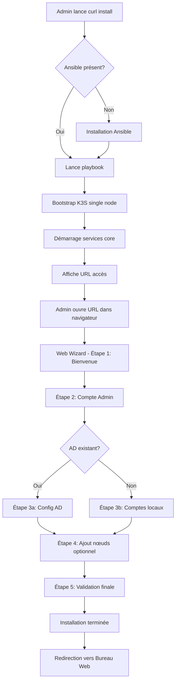
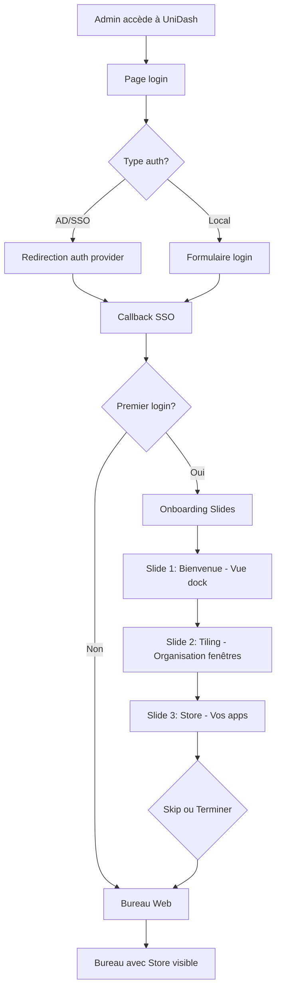
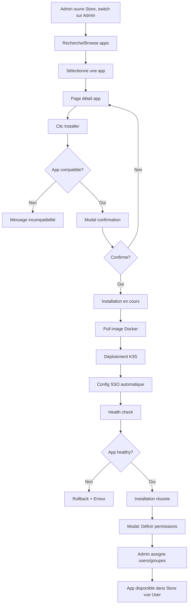
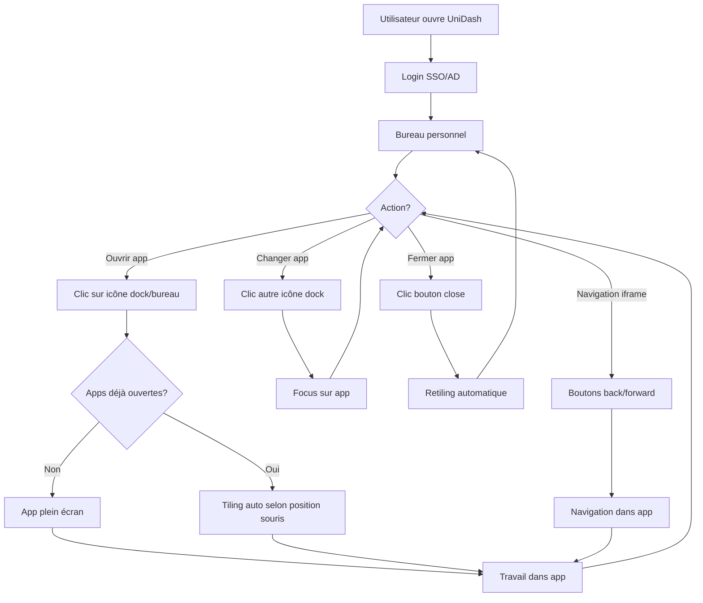

# UX Design Specification - UniDash

**Author:** Gabriel
**Date:** 2026-01-09

---

## Executive Summary

### Project Vision

UniDash est un bureau web unifié qui rend la gestion d'infrastructure serveur aussi simple qu'un smartphone. La métaphore du "bureau" (type Windows/macOS) dans le navigateur est LE différenciateur - une approche Blue Ocean sans concurrent direct.

**Philosophie UX core :** "Je veux ça, je l'installe, ça marche" - zéro friction à tous les niveaux.

### Target Users

| Persona | Profil | Niveau technique | Besoin UX clé |
|---------|--------|------------------|---------------|
| **Thomas** | Admin junior, 24 ans, PME | Intermédiaire | Wizard guidé, pas de YAML |
| **Marc** | Dev senior fatigué, 38 ans, homelab | Expert (mais veut pas l'être ici) | Zéro maintenance, "set & forget" |
| **Giselle** | Comptable, 52 ans | Débutant | Interface familière, 0 formation |
| **Philippe** | Patron PME, 48 ans | Non-technique | Démo compréhensible en 30 sec |
| **Sophie** | Dev freelance, 32 ans | Expert | SDK simple, doc claire |
| **Karim** | Prestataire IT, 35 ans | Avancé | Interface standardisée entre clients |

**Persona de référence UX :** Giselle - si elle comprend l'interface sans formation, tout le monde la comprendra.

### Key Design Challenges

| Défi | Complexité | Stratégie |
|------|------------|-----------|
| **Double audience** | High | Interface unique avec profondeur progressive - Giselle voit le simple, Thomas accède au complexe |
| **Performance iFrames** | High | Lazy loading, limite 4-5 apps simultanées, virtualisation |
| **Métaphore bureau moderne** | Medium | Design contemporain (flat/material), éviter le skeuomorphisme Windows 95 |
| **Store avec switch Admin/User** | Medium | Interface unique avec switch button - Admin installe, User ajoute a son bureau |

### Design Opportunities

1. **"Moment Wow" installation** - Wizard impressionnant qui transforme la complexité K3S en 3 clics
2. **Familiarité bureau** - Exploiter la mémoire musculaire Windows/macOS (fenêtres, docks, raccourcis)
3. **Test Giselle** - Métrique de validation : une non-technicienne accède à ses fichiers sans aide
4. **Démo Philippe** - L'interface se vend elle-même en 30 secondes de présentation

---

## Core User Experience

### Defining Experience

**Action core quotidienne :** Ouvrir une app sur son bureau (geste de Giselle, Marc, tous les end-users).

**Action core occasionnelle :** Installer une app depuis le Store (moment Wow de Thomas).

**Philosophie :** Chaque interaction doit être aussi intuitive que sur un OS desktop natif, mais optimisée pour le contexte web (espace limité, performance iFrames).

### Platform Strategy

| Plateforme | Support | Priorité |
|------------|---------|----------|
| **Desktop web** | MVP | Primary - expérience de référence |
| **Tablette** | MVP (responsive) | Secondary - même interface adaptée |
| **Mobile** | MVP (responsive) | Tertiary - navigation simplifiée |

**Contrainte critique :** L'espace navigateur est déjà réduit → le chrome UniDash doit être minimal pour laisser les apps s'afficher correctement.

### Effortless Interactions

1. **Clic app → app visible en < 1 sec** - pas de loading screen prolongé
2. **SSO transparent** - jamais de re-login entre apps
3. **Fenêtres = réflexes natifs** - drag, resize, close fonctionnent comme attendu
4. **Store (vue User) = 1 clic** - ajouter une app au bureau instantanément

### Critical Success Moments

| Moment | Persona | Succès | Échec |
|--------|---------|--------|-------|
| Premier login | Giselle | "Ah, ça ressemble à ce que je connais" | "C'est quoi ce truc ?" |
| Première app ouverte | Tous | App visible instantanément | Écran blanc, loading... |
| Wizard installation | Thomas | "30 min et c'est fait" | "Encore du YAML..." |
| Démo au patron | Philippe | "Je comprends, on fait ça" | "C'est technique ton truc" |

### Experience Principles

1. **Minimalisme spatial** - Chaque pixel compte, le chrome UniDash s'efface pour laisser place aux apps
2. **Familiarité Windows 11 + Polish macOS** - Layout et boutons Windows, finition et cohérence macOS
3. **Tiling intelligent** - Organisation efficace inspirée des tiling WM Linux, pas de fenêtres libres chaotiques
4. **Zéro apprentissage** - Si Giselle doit réfléchir, c'est un échec de design

---

## Desktop Layout Architecture

### Dock

| Contexte | Position | Style | Comportement |
|----------|----------|-------|--------------|
| **Desktop** | Latéral gauche | Fin, icônes seules | Toujours visible, tooltips au hover |
| **Tablette** | Latéral gauche (plus fin) | Icônes seules | Toujours visible |
| **Mobile** | Barre bas | Icônes + menu overflow | Toujours visible |

**Contenu du dock :**
- Icônes apps (raccourcis individuels)
- Icônes layouts (groupes d'apps positionnées) - à définir
- Accès Store (vue User par défaut, switch Admin si permissions)
- Paramètres utilisateur

### Tiling System

**Layouts supportés :**

| Layout | Zones | Use case |
|--------|-------|----------|
| **Plein écran** | 1 | Focus, app unique |
| **2 colonnes** | 2 (50/50 ou 70/30) | Multitâche léger |
| **3 colonnes** | 3 (33/33/33) | Power user |
| **4 quadrants** | 4 (2x2) | Dashboard, monitoring |

**Contrainte format web :** Chaque zone doit avoir un ratio compatible avec les standards (desktop 16:9, tablette portrait, mobile). Pas de splits horizontaux bizarres qui écraseraient les apps.

**Layouts sauvegardables :** L'utilisateur peut sauvegarder un arrangement (apps + positions) comme raccourci dans le dock.

### Responsive Breakpoints

| Breakpoint | Dock | Tiling max | Notes |
|------------|------|------------|-------|
| Desktop (>1024px) | Latéral gauche | 4 zones | Expérience complète |
| Tablette (768-1024px) | Latéral gauche fin | 2 zones | Tiling simplifié |
| Mobile (<768px) | Barre bas + menu | 1 app seule | Navigation app par app |

---

## Desired Emotional Response

### Primary Emotional Goals

**Émotion primaire :** Confiance tranquille
L'utilisateur sait que ça va marcher, sans stress ni incertitude.

**Émotions secondaires :**
- Familiarité - "Je reconnais ce pattern"
- Efficacité - "C'est rapide, ça ne me fait pas perdre de temps"
- Fierté - "J'ai réussi quelque chose de complexe facilement"

### Emotional Journey

| Étape | Émotion | Comment |
|-------|---------|---------|
| Première vue | Reconnaissance | Interface desktop familière |
| Premier clic | Confirmation | Comportement attendu |
| App ouverte | Satisfaction | Instantané, fluide |
| Erreur | Sérénité | Message clair, solution évidente |
| Retour | Confort | État préservé |

### Micro-Emotions to Cultivate

| Cultiver | Éviter |
|----------|--------|
| Confiance | Confusion |
| Efficacité | Frustration |
| Fierté | Anxiété technique |
| Sérénité | Panique |

### Delight Strategy

**Animations :** Discrètes et élégantes - transitions fluides, feedback visuel subtil

**Sons :** Style macOS - doux, courts, non-agressifs pour ouverture apps, menus, notifications

**Onboarding :** Slide tour à la première connexion uniquement
- 3-4 slides max
- Bouton Skip visible
- Ne revient jamais après première vue
- Présente : dock, tiling, Store

### Emotional Design Principles

1. **Calme > Excitation** - Pas de gamification, pas de récompenses artificielles
2. **Confirmation silencieuse** - Le système confirme les actions sans interrompre
3. **Erreurs rassurantes** - Jamais de message d'erreur anxiogène
4. **Qualité perceptible** - Sons et animations communiquent le soin apporté

---

## UX Pattern Analysis & Inspiration

### Inspiring Products Analysis

| Produit | Composant | Ce qu'on prend |
|---------|-----------|----------------|
| **Windows 11** | Layout global | Placement boutons (fermer/minimiser à droite), familiarité utilisateur |
| **macOS** | Polish & Sons | Finition visuelle, cohérence, sons système (référence audio) |
| **Tiling WM Linux** (i3/Sway) | Gestion fenêtres | Organisation efficace, layouts sauvegardables, pas de chaos |
| **Linear** | Bureau web | Polish extrême, minimalisme, animations subtiles, palette sobre |
| **macOS App Store** | Store | Cards épurées, présentation claire, screenshots |
| **Vercel** | Wizard installation | Étapes claires, progression visible, one-click |
| **DigitalOcean** | Documentation CLI | Qualité exemplaire, commandes claires, explications contextuelles |

### Transferable UX Patterns

**Navigation :**
- Dock latéral fin (macOS) adapté pour économiser l'espace vertical
- Tiling zones prédéfinies (Linux WM) au lieu de fenêtres libres chaotiques

**Interactions :**
- Transitions fluides et subtiles (Linear)
- Feedback sonore discret (macOS)
- One-click install (Vercel)

**Visuels :**
- Palette sobre avec accents (Linear)
- Cards épurées pour le Store (macOS App Store)
- Dark/Light mode avec détection système auto

### Anti-Patterns to Avoid

| Anti-pattern | Pourquoi l'éviter |
|--------------|-------------------|
| Fenêtres libres superposées | Chaos visuel, perte de contexte, incompatible avec le web |
| Barre de tâches en bas | Perd de l'espace vertical précieux dans un navigateur |
| Store surchargé de filtres | Confusion, surcharge cognitive pour Giselle |
| Wizard avec trop d'étapes | Abandon, frustration, "encore un truc compliqué" |
| Sons stridents/gamifiés | Cheap, non-professionnel, agaçant |
| Dark mode forcé | Accessibilité, préférences utilisateur ignorées |

### Design Inspiration Strategy

**Adopter directement :**
- Sons macOS comme référence audio
- Polish visuel Linear
- Structure Store macOS App Store
- Wizard style Vercel

**Adapter :**
- Dock macOS → latéral gauche (économie espace vertical)
- Tiling Linux → simplifié (4 layouts max, pas de config complexe)
- Filtres Store → discrets (dropdown/chips, pas barre massive)

**Éviter :**
- Fenêtres libres Windows
- Gamification
- Complexité configuration tiling avancée

### Theme Strategy

**Mode couleur :**
- Détection automatique du mode système (prefers-color-scheme)
- Switch manuel disponible dans les paramètres
- Light et Dark modes tous deux soignés (pas de dark mode "afterthought")

### Installation Dual-Mode

| Mode | Cible | Style |
|------|-------|-------|
| **Web Wizard** | Giselle, Thomas | Vercel-like, au premier boot après upgrade, étapes visuelles |
| **CLI** | Marc, Karim | Documentation DigitalOcean-quality, `curl \| bash` ou équivalent |

---

## Design System Foundation

### Design System Choice

**Stack technique UX :**

| Composant | Technologie | Rôle |
|-----------|-------------|------|
| **Framework CSS** | Tailwind CSS | Utilities, responsive, dark mode (`dark:`), animations |
| **Composants UI** | Headless UI | Modals, dropdowns, menus, transitions - accessibles et sans style |
| **Custom** | From scratch | Tiling system, dock, gestion fenêtres/iFrames |

### Rationale for Selection

**Tailwind CSS :**
- Flexibilité totale pour atteindre le polish Linear
- Dark mode natif avec `prefers-color-scheme`
- Animations et transitions intégrées
- Léger, pas de CSS inutilisé (purge)
- Compatible Astro nativement

**Headless UI :**
- Composants accessibles (ARIA, navigation clavier) sans effort
- Aucun style imposé = liberté visuelle totale
- Transitions animées incluses
- Maintenu par Tailwind Labs = intégration parfaite
- Léger, pas de bloat

### Implementation Approach

**Phase 1 - Fondations :**
- Setup Tailwind + Headless UI dans Astro
- Définir design tokens (couleurs, spacing, typography)
- Créer palette Light/Dark cohérente

**Phase 2 - Composants custom :**
- Dock latéral
- Tiling system (zones, layouts)
- Gestion fenêtres/iFrames
- Store cards

**Phase 3 - Polish :**
- Animations subtiles (transitions, micro-interactions)
- Sons macOS-like
- Onboarding slides

### Customization Strategy

**Design Tokens à définir :**
- Palette couleurs (neutral, accent, semantic)
- Typography (font family, sizes, weights)
- Spacing scale
- Border radius (coins arrondis Windows 11)
- Shadows (subtiles, style macOS)
- Animation durations et easings

**Composants Headless UI utilisés :**
- `Dialog` → Modals, wizard steps
- `Menu` → Dropdowns, context menus
- `Popover` → Tooltips enrichis
- `Transition` → Animations d'entrée/sortie
- `Listbox` → Selects custom
- `Switch` → Toggles (dark mode, settings)

---

## Defining Experience

### The Core Interaction

**L'expérience qui définit UniDash :**

> "Accéder à toutes mes apps d'entreprise dans un seul bureau web, comme si c'était Windows mais dans mon navigateur"

**Phrase utilisateur :** "J'ai toutes mes apps dans un bureau web, je clique, ça marche"

### User Mental Model

**Ce qu'ils connaissent :**

| Référence | Attente transférée |
|-----------|-------------------|
| Bureau Windows/macOS | Icônes, fenêtres, dock, familiarité |
| Smartphone | Apps qu'on clique, ouverture instantanée |
| Portail web entreprise | Login unique, tout accessible |

**Où ils galèrent actuellement :**
- 15 onglets ouverts (Portainer, Nextcloud, Proxmox...)
- Login différent par service
- "C'est quoi l'URL déjà ?"
- Interfaces incohérentes entre services

### Success Criteria

| Critère | Mesure | Pourquoi |
|---------|--------|----------|
| Rapidité | Clic → app visible < 1 sec | Sensation d'instantanéité |
| SSO transparent | Jamais de re-login | Zéro friction |
| Familiarité | "Ça ressemble à ce que je connais" | Pas d'apprentissage |
| Persistance | État préservé au retour | Confiance |

### Novel vs Established Patterns

**Patterns établis (à réutiliser) :**
- Dock avec icônes (macOS/Windows)
- Fenêtres avec boutons fermer/minimiser
- Drag & drop
- Tooltips au hover

**Patterns adaptés (innovation incrémentale) :**
- Tiling Linux → simplifié pour le web
- Store mobile → adapté pour apps serveur
- SSO → transparent et automatique

**Aucun pattern vraiment "novel"** - la force d'UniDash est la familiarité, pas l'innovation UX radicale.

### Experience Mechanics

**1. Initiation :**
- L'utilisateur voit le dock avec ses apps
- Clic sur une icône

**2. Interaction :**
- L'app s'ouvre dans une zone de tiling (ou plein écran si seule)
- Son discret de confirmation (style macOS)
- Animation fluide d'apparition

**3. Feedback :**
- L'app est visible et utilisable immédiatement
- L'icône du dock montre un indicateur "app ouverte"
- Pas de loading screen (ou ultra-bref)

**4. Completion :**
- L'utilisateur utilise l'app normalement
- Fermeture via bouton X ou raccourci
- Son discret de fermeture
- L'état de l'app est préservé pour la prochaine ouverture

---

## Visual Design Foundation

### Color System

**Palette Neutre (Base):**

| Token | Light Mode | Dark Mode |
|-------|------------|-----------|
| Background | `#FFFFFF` | `#0F172A` |
| Surface | `#F8FAFC` | `#1E293B` |
| Border | `#E2E8F0` | `#334155` |
| Text Primary | `#0F172A` | `#F8FAFC` |
| Text Secondary | `#64748B` | `#94A3B8` |
| Text Muted | `#94A3B8` | `#64748B` |

**Couleurs d'Accentuation (Personnalisables par l'utilisateur):**

| Accent | Light Mode | Dark Mode |
|--------|------------|-----------|
| Blue (défaut) | `#3B82F6` | `#60A5FA` |
| Purple | `#8B5CF6` | `#A78BFA` |
| Green | `#10B981` | `#34D399` |
| Orange | `#FB923C` | `#FDBA74` |
| Pink | `#F472B6` | `#F9A8D4` |
| Teal | `#2DD4BF` | `#5EEAD4` |

**Couleurs Sémantiques:**

| Token | Light Mode | Dark Mode | Usage |
|-------|------------|-----------|-------|
| Success | `#10B981` | `#34D399` | Actions réussies, validations |
| Warning | `#F59E0B` | `#FBBF24` | Alertes non-critiques |
| Error | `#EF4444` | `#F87171` | Erreurs, actions destructives |
| Info | `#3B82F6` | `#60A5FA` | Informations contextuelles |

### Typography System

**Police Principale:** Inter (Variable Font)
- Excellent rendu écran, optimisée pour les interfaces
- Support complet des caractères internationaux
- Poids disponibles : 400 (Regular), 500 (Medium), 600 (SemiBold), 700 (Bold)

**Type Scale:**

| Token | Size | Weight | Usage |
|-------|------|--------|-------|
| Display | 2.25rem (36px) | 700 | Titres principaux wizard |
| H1 | 1.875rem (30px) | 700 | Titres de pages |
| H2 | 1.5rem (24px) | 600 | Titres de sections |
| H3 | 1.25rem (20px) | 600 | Sous-titres |
| Body | 1rem (16px) | 400 | Texte courant |
| Small | 0.875rem (14px) | 400 | Labels, métadonnées |
| Tiny | 0.75rem (12px) | 500 | Badges, tooltips |

**Line Heights:**
- Headings : 1.2
- Body : 1.5
- Small text : 1.4

### Spacing & Layout Foundation

**Spacing Scale (base 4px):**

| Token | Value | Usage |
|-------|-------|-------|
| xs | 4px | Espacement minimal, icônes |
| sm | 8px | Padding boutons, gaps serrés |
| md | 12px | Padding cards, margins |
| lg | 16px | Sections, spacing standard |
| xl | 24px | Séparations majeures |
| 2xl | 32px | Sections principales |
| 3xl | 48px | Séparations de blocs |

**Layout Grid:**
- Dock : largeur fixe 56px (desktop), 48px (tablette)
- Zone de travail : `100vw - dock_width`
- Gutters internes : 16px
- Border radius : 8px (éléments), 12px (cards), 16px (modals)

**Shadows (style macOS subtil):**

| Token | Value | Usage |
|-------|-------|-------|
| sm | `0 1px 2px rgba(0,0,0,0.05)` | Boutons, inputs |
| md | `0 4px 6px rgba(0,0,0,0.07)` | Cards, dropdowns |
| lg | `0 10px 15px rgba(0,0,0,0.1)` | Modals, fenêtres |
| xl | `0 20px 25px rgba(0,0,0,0.15)` | Fenêtres focusées |

### Accessibility Considerations

**Contrastes WCAG AA:**
- Texte sur fond : ratio minimum 4.5:1
- Grands textes (18px+) : ratio minimum 3:1
- Éléments interactifs : ratio minimum 3:1

**Focus States:**
- Ring de focus visible : 2px solid accent color
- Offset : 2px
- Jamais de `outline: none` sans alternative visible

**Personnalisation Utilisateur:**
- Choix couleur d'accentuation (6 options prédéfinies)
- Changement d'image de fond du bureau (upload ou galerie)
- Respect de `prefers-reduced-motion` pour les animations
- Respect de `prefers-color-scheme` avec override manuel

---

## Design Direction Decision

### Design Directions Explored

Six directions de design ont été créées et visualisées dans `ux-design-directions.html` :

| Direction | Description | Caractéristiques |
|-----------|-------------|------------------|
| **Standard** | Dock avec bordures complètes | Équilibre visuel, familiarité Windows 11, indicateur app active |
| **Compact** | Dock plus fin (48px) | Plus d'espace contenu, icons 20px, padding réduit |
| **Minimal** | Dock sans bordures externes | Ultra-épuré style Linear, fond transparent, focus sur le contenu |
| **Dense** | Plus d'informations visibles | Productivité maximale, espacement réduit |
| **Airy** | Plus d'espace et respiration | Confort visuel, margins généreux |
| **Glassmorphism** | Effets de transparence | Moderne, backdrop-blur, style macOS Big Sur |

**Layouts de tiling explorés :**
- 1 colonne (fullscreen)
- 2 colonnes (50/50)
- 3 colonnes (33/33/33)
- 4 zones (grille 2x2)

**Vue Bureau (Desktop & Mobile) :**
- Wallpaper personnalisable en arrière-plan
- Groupe d'icônes d'applications centrées au milieu de l'écran
- Effet glassmorphism sur le conteneur d'icônes (backdrop-blur, bordure semi-transparente)
- Icônes avec gradient coloré et ombre portée
- Labels sous chaque icône avec text-shadow pour lisibilité sur wallpaper

**Vue mobile :**
- Header avec boutons navigation iframe (back/forward)
- Boutons fenêtre agrandis (24px, style macOS) avec icônes X et _ centrées
- Dock en bas avec icônes circulaires alignées à gauche
- Indicateur app active par bordure accent
- Bouton overflow (3 points) à droite

**Dock-group et séparateurs :**
- Groupe visuel pour les contrôles système (tiroir d'apps + sélecteur de dock)
- Séparateur horizontal/vertical entre le dock-group et les raccourcis d'apps
- Sur desktop : dock-group en haut avec coins arrondis (top: 8px)
- Sur mobile : dock-group à gauche avec demi-cercles (left: 50%)

**Wizard d'installation :**
- Wallpaper en arrière-plan
- Formulaire dans une boîte avec bordure, coins arrondis et ombre portée
- Barre de progression en haut (4 étapes)
- Style Vercel avec fond surface et polish visuel

### Chosen Direction

**Direction principale : Standard**

Le mode Standard a été choisi comme direction principale car il offre :
- Le meilleur équilibre entre familiarité et modernité
- Une structure claire avec dock bordé qui délimite bien les zones
- Un indicateur visuel clair pour l'app active (trait coloré)
- Une compatibilité optimale avec tous les layouts de tiling

**Éléments combinés des autres directions :**
- Du mode **Minimal** : inspiration pour les fenêtres sans bordures excessives
- Du mode **Compact** : option pour utilisateurs préférant plus d'espace de travail
- Navigation iframe (back/forward) sur toutes les titlebars

### Design Rationale

1. **Familiarité utilisateur** : Le mode Standard ressemble le plus à ce que les utilisateurs connaissent (Windows 11 + macOS), réduisant la courbe d'apprentissage

2. **Clarté visuelle** : Les bordures du dock créent une séparation nette entre navigation et contenu, évitant la confusion

3. **Flexibilité** : Ce design s'adapte bien aux différents layouts de tiling sans perdre sa cohérence

4. **Accessibilité** : Les indicateurs visuels (traits colorés, bordures) sont clairs et conformes WCAG

### Implementation Approach

**Desktop :**
- Dock latéral gauche 56px avec bordure droite
- Icônes 24px avec indicateur actif (trait vertical accent)
- Titlebars avec nav-controls (back/forward) + window-controls (minimize/maximize/close)
- Tiling layouts : 1, 2, 3, 4 colonnes selon le choix utilisateur

**Mobile :**
- Header 52px avec nav-controls + window-controls agrandis
- Pas de bouton maximize (fullscreen forcé sur mobile)
- Dock bottom bar avec icônes circulaires 40px
- Indicateur actif : bordure accent 2px
- Bouton overflow pour apps épinglées supplémentaires

**Store :**
- Barre de recherche en haut
- Filtres par chips (catégories)
- Grille de cards style macOS App Store

---

## User Journey Flows

### Flows Overview

| Flow | Cible | Description |
|------|-------|-------------|
| **1. Installation** | Admin technique (Thomas, Karim) | CLI → Ansible → Web wizard |
| **2. Premier login admin** | Admin technique | Onboarding complet (dock, tiling, Store) |
| **3. Installation app** | Admin | Store (vue Admin) → déploiement → permissions |
| **4. Personnalisation bureau** | Power user sans droits admin (dev ESN) | Store (vue User) → ajout apps → organisation dock |
| **5. Usage quotidien** | Tous | Bureau → clic app → travail |

### Flow 1: Installation Initiale

**Entry points :** Admin découvre UniDash (Thomas, Marc) ou Prestataire déploie chez client (Karim)

**Trois modes d'installation :**

| Mode | Cible | Commande | Description |
|------|-------|----------|-------------|
| **Interactif** | Thomas, débutants | `curl -sL unidash.io/install \| bash` | Bootstrap minimal → config via Web Wizard |
| **Automatisé** | Marc, scripts | `curl ... \| bash -s -- --cluster-name=prod --admin-email=...` | Installation complète sans interaction |
| **Masse** | Karim, entreprises | `ansible-playbook unidash.yml -i inventory.ini` | Déploiement N machines simultanément |

**Note technique :** Le `curl|bash` installe Ansible et lance le playbook. L'architecture Ansible-first permet le déploiement de masse en entreprise.



### Flow 2: Premier Login Admin & Onboarding

**Règles onboarding :**
- Ne s'affiche qu'une seule fois (flag en BDD)
- 3-4 slides max
- Bouton "Skip" visible sur chaque slide
- Ne revient JAMAIS après première vue
- Présente : dock, tiling, Store



### Flow 3: Installation App (Store vue Admin)



### Flow 4: Personnalisation Bureau (Power User)

**Cible :** Utilisateurs tech-aware sans droits admin (dev ESN, designer, DevOps junior)

Ces utilisateurs savent ce qu'ils veulent, organisent leur espace de travail, créent des layouts thématiques dans leur dock.

```mermaid
flowchart TD
    A[User ouvre Store (vue User)] --> B[Voit apps autorisées]
    B --> C[Recherche ou browse]
    C --> D[Sélectionne app]
    D --> E[Clic Ajouter au bureau]
    E --> F{Où ajouter?}
    F -->|Groupe central| G[App ajoutée au groupe icônes]
    F -->|Dock| H[App ajoutée au dock]
    G --> I[Confirmation visuelle]
    H --> I
    I --> J[App disponible sur bureau]

    J --> K[User peut réorganiser]
    K --> L[Drag & drop dans dock]
    L --> M[Sauvegarde layout comme raccourci]
```

**Règles organisation :**
- Groupe d'icônes au centre du bureau = organisation forcée (pas d'icônes éparpillées)
- Drag & drop pour réorganiser dans dock
- Layouts sauvegardables (apps + positions) comme raccourci dock
- Docks thématiques possibles

### Flow 5: Usage Quotidien (Tous)

**Couvre tous les utilisateurs :** de Giselle qui clique sur Fichiers à Marc qui ouvre 4 apps en tiling.



### Journey Patterns

| Pattern | Comportement | Feedback visuel |
|---------|-------------|-----------------|
| **Ouverture app** | Plein écran si seule, tiling sinon | Animation slide-in 200ms |
| **Switch app** | Focus immédiat | Indicateur actif sur dock |
| **Fermeture** | Retiling auto des apps restantes | Animation fade-out 150ms |
| **Navigation iframe** | Back/forward comme navigateur | Boutons grisés si pas d'historique |
| **Drag dock** | Réorganisation par glisser | Ghost preview de l'icône |
| **Erreur** | Message non-bloquant | Toast en bas, disparaît après 5s |

### Flow Optimization Principles

1. **Minimum de clics** - Chaque action courante accessible en 1-2 clics max
2. **Feedback immédiat** - Toute action a une réponse visuelle < 100ms
3. **État préservé** - Retour au bureau = même layout qu'avant
4. **Erreurs récupérables** - Toujours une action possible après erreur
5. **Progressive disclosure** - Complexité cachée jusqu'à ce qu'on en ait besoin

---

## Component Strategy

### Style par Plateforme

| Plateforme | Direction choisie | Caractéristiques |
|------------|-------------------|------------------|
| **Desktop (>1024px)** | Compact | Dock 48px, icônes 20px, plus d'espace pour le contenu |
| **Tablette (768-1024px)** | Standard | Dock 56px, icônes 24px, meilleure lisibilité tactile |
| **Mobile (<768px)** | Mobile | Bottom bar 56px, icônes circulaires 40px |

### Design System Components (Headless UI)

| Composant | Usage UniDash |
|-----------|---------------|
| `Dialog` | Modals, wizard steps, confirmations installation/désinstallation |
| `Menu` | Context menus (clic droit sur app), overflow menu mobile |
| `Popover` | Tooltips enrichis sur dock (nom app + raccourci) |
| `Transition` | Animations slide-in/fade-out des fenêtres |
| `Listbox` | Filtres catégories Store, sélection permissions |
| `Switch` | Dark mode, paramètres utilisateur |
| `Tab` | Navigation dans les paramètres, pages détail Store |
| `Disclosure` | Sections expandables dans wizard et settings |

### Custom Components

| Composant | Purpose | States |
|-----------|---------|--------|
| **Dock** | Navigation principale, accès apps | default, hover, app-active, drag-over |
| **TilingZone** | Conteneur de layout pour apps | empty, occupied, drag-target, resizing |
| **WindowFrame** | Cadre fenêtre avec titlebar + iframe | default, focused, maximized, minimized |
| **WindowControls** | Boutons minimize/maximize/close | default, hover, disabled |
| **NavControls** | Boutons back/forward iframe | default, hover, disabled (grisé si pas d'historique) |
| **AppIcon** | Icône app dans dock/bureau | default, hover, active, dragging |
| **StoreCard** | Card app dans le Store | default, hover, installed |
| **OnboardingSlide** | Slide du tutoriel premier login | active, visited |
| **WizardStep** | Étape du wizard installation | pending, current, completed, error |
| **Toast** | Notification feedback | info, success, warning, error |
| **SearchBar** | Barre recherche Store | default, focused, with-results |
| **FilterChip** | Tag filtre catégorie | default, selected |
| **AppDrawer** | Tiroir d'applications accessible depuis le dock | closed, open |

### Component Implementation Strategy

**Approche :**
- Tous les composants custom utilisent les design tokens Tailwind (couleurs, spacing, shadows)
- Headless UI fournit l'accessibilité (ARIA, keyboard nav) pour les composants interactifs
- Composants custom suivent les mêmes patterns d'accessibilité

**Tokens partagés :**
- Couleurs : `--accent`, `--surface`, `--border`, etc.
- Spacing : base 4px (xs/sm/md/lg/xl)
- Radius : 8px (éléments), 12px (cards), 16px (modals)
- Shadows : sm/md/lg/xl selon élévation

### Implementation Roadmap

**Phase 1 - Core (MVP critique) :**
- Dock (navigation centrale)
- TilingZone + WindowFrame (affichage apps)
- AppIcon (interaction principale)
- WindowControls + NavControls (contrôle fenêtres)

**Phase 2 - Store & Onboarding :**
- StoreCard + SearchBar + FilterChip + ViewSwitch (Store avec switch Admin/User)
- WizardStep (installation)
- OnboardingSlide (premier login)

**Phase 3 - Polish :**
- Toast (feedback utilisateur)
- Animations et transitions raffinées
- Sons système (optionnel)

---

## UX Consistency Patterns

### Button Hierarchy

| Type | Usage | Style |
|------|-------|-------|
| **Primary** | Action principale unique par écran (Installer, Confirmer, Sauvegarder) | Fond accent, texte blanc, shadow-sm |
| **Secondary** | Actions alternatives (Annuler, Retour) | Fond transparent, bordure, texte accent |
| **Ghost** | Actions tertiaires (Skip, Plus tard) | Pas de fond ni bordure, texte muted |
| **Danger** | Actions destructives (Supprimer, Désinstaller) | Fond error, texte blanc |
| **Icon-only** | Actions compactes (close, minimize, nav) | Rond ou carré, hover visible |

**Règles :**
- Maximum 1 bouton Primary par vue
- Primary toujours à droite dans les paires (Annuler | Confirmer)
- Danger jamais en Primary sauf écran de confirmation dédié

### Feedback Patterns

| Type | Déclencheur | Composant | Durée |
|------|-------------|-----------|-------|
| **Success** | Action réussie (app installée, settings sauvés) | Toast vert, icône check | 3s auto-dismiss |
| **Error** | Échec récupérable | Toast rouge, icône X, action retry | Persistent jusqu'à dismiss |
| **Warning** | Action risquée imminente | Toast orange, icône alert | 5s ou action |
| **Info** | Information contextuelle | Toast bleu, icône info | 3s auto-dismiss |
| **Progress** | Action longue (installation) | Modal avec barre de progression | Jusqu'à completion |

**Position des toasts :** Bas droite, empilés vers le haut, max 3 visibles

### Navigation Patterns

| Pattern | Comportement | Feedback |
|---------|-------------|----------|
| **Dock click** | Ouvre app ou focus si déjà ouverte | Indicateur actif (trait accent) |
| **Dock drag** | Réorganise les icônes | Ghost preview pendant drag |
| **Tiling auto** | Nouvelle app → split selon position souris | Animation slide 200ms |
| **Back/Forward** | Navigation historique iframe | Boutons grisés si indisponible |
| **Window close** | Ferme app, retile les autres | Fade-out 150ms |
| **Window focus** | Clic sur fenêtre → focus | Border accent sur fenêtre active |

### Empty States

| Contexte | Message | Action |
|----------|---------|--------|
| **Bureau vide** | "Ajoutez des apps depuis le Store" | Bouton → Store |
| **Store vide (filtré)** | "Aucune app dans cette catégorie" | Lien → Réinitialiser filtres |
| **Recherche sans résultat** | "Aucun résultat pour '[query]'" | Suggestions alternatives |
| **Dock vide** | Icône Store + Settings par défaut | - |

**Style empty state :** Icône illustrative 64px, texte muted, action Primary si applicable

### Loading States

| Contexte | Pattern | Durée max avant skeleton |
|----------|---------|-------------------------|
| **App ouverture** | Skeleton du contenu iframe | 500ms |
| **Store browse** | Skeleton cards (3x2 grille) | 300ms |
| **Installation app** | Modal progress avec étapes | N/A (progress réel) |
| **Login** | Spinner centré | 2s avant timeout message |

**Règle :** Jamais de spinner seul > 500ms. Toujours skeleton ou message contextuel.

### Form Patterns

| Pattern | Comportement |
|---------|-------------|
| **Validation** | Inline sous le champ, apparaît au blur ou submit |
| **Erreur** | Bordure rouge + message rouge sous le champ |
| **Succès** | Bordure verte temporaire (1s) puis retour normal |
| **Required** | Astérisque rouge après le label |
| **Disabled** | Opacité 50%, cursor not-allowed |

**Wizard spécifique :**
- Étapes numérotées en haut
- Navigation Previous/Next en bas
- Validation par étape avant Next
- Skip autorisé uniquement si step optionnel

### Modal Patterns

| Type | Usage | Fermeture |
|------|-------|-----------|
| **Confirmation** | Action destructive ou importante | Boutons explicites uniquement |
| **Information** | Message important | Click outside, Escape, bouton |
| **Form modal** | Édition rapide | Boutons Save/Cancel |
| **Progress modal** | Action longue | Non-dismissible pendant action |

**Règles modals :**
- Overlay semi-transparent (50% noir) - appliqué sur desktop ET mobile
- Animation scale-in 150ms
- Focus trap à l'intérieur
- Escape ferme (sauf progress)
- Max largeur 480px (form), 320px (confirmation)

**Overlays mobile spécifiques :**
- Tiroir d'applications : overlay assombrissant le wallpaper derrière
- Sélecteur de dock : même comportement avec overlay
- L'overlay permet de distinguer clairement le modal du contenu derrière

### Micro-interactions

| Interaction | Animation | Durée |
|-------------|-----------|-------|
| **Hover bouton** | Background lighten/darken | 150ms ease |
| **Click bouton** | Scale 0.98 | 100ms |
| **Ouverture menu** | Fade + slide down | 150ms ease-out |
| **Fermeture menu** | Fade out | 100ms |
| **Toast apparition** | Slide from right | 200ms ease-out |
| **Toast disparition** | Fade out | 150ms |
| **Window open** | Scale 0.95→1 + fade | 200ms ease-out |
| **Window close** | Fade out | 150ms |

### Accessibility Patterns

| Pattern | Implementation |
|---------|----------------|
| **Focus visible** | Ring 2px accent, offset 2px |
| **Skip link** | Premier élément focusable → contenu principal |
| **ARIA labels** | Tous les boutons icon-only |
| **Keyboard nav** | Tab order logique, Escape ferme modals/menus |
| **Reduced motion** | Respecter `prefers-reduced-motion`, animations → instant |
| **Color contrast** | Minimum 4.5:1 texte, 3:1 éléments interactifs |

---

## Responsive Design & Accessibility

### Responsive Strategy

**Approche :** Desktop-first (l'expérience de référence est le bureau web desktop)

| Plateforme | Stratégie | Expérience |
|------------|-----------|------------|
| **Desktop** | Expérience complète | Dock latéral Compact (48px), tiling 1-4 zones, toutes fonctionnalités |
| **Tablette** | Expérience adaptée | Dock latéral Standard (56px), tiling max 2 zones, touch-optimized |
| **Mobile** | Expérience simplifiée | Bottom bar, 1 app fullscreen, navigation app par app |

**Desktop (>1024px) :**
- Tiling jusqu'à 4 zones (2x2)
- Dock compact pour maximiser l'espace contenu
- Hover states et tooltips complets
- Raccourcis clavier disponibles

**Tablette (768-1024px) :**
- Tiling max 2 colonnes
- Dock standard pour meilleure lisibilité tactile
- Touch targets 44px minimum
- Gestures swipe pour navigation

**Mobile (<768px) :**
- Une seule app visible à la fois
- Bottom dock avec overflow menu
- Icônes circulaires 40px
- Navigation simplifiée (pas de tiling)

### Breakpoint Strategy

| Breakpoint | Valeur | Comportement |
|------------|--------|--------------|
| **Mobile** | < 768px | Bottom bar, fullscreen apps, navigation séquentielle |
| **Tablette** | 768px - 1023px | Dock latéral standard, tiling max 2 zones |
| **Desktop** | ≥ 1024px | Dock latéral compact, tiling complet |
| **Large desktop** | ≥ 1440px | Idem desktop, plus d'espace pour le contenu |

**Approche CSS :**
```css
/* Mobile first puis overrides */
@media (min-width: 768px) { /* Tablette */ }
@media (min-width: 1024px) { /* Desktop */ }
```

### Accessibility Strategy

**Niveau de conformité : WCAG 2.1 AA**

Choisi car :
- Standard industrie pour applications B2B
- Couvre les besoins de Giselle (non-technicienne) et utilisateurs avec handicaps
- Légalement requis dans de nombreuses juridictions pour software entreprise

**Conformité par catégorie :**

| Catégorie | Exigences |
|-----------|-----------|
| **Perceivable** | Contrastes 4.5:1, texte redimensionnable, alternatives textuelles |
| **Operable** | Navigation clavier complète, pas de piège focus, assez de temps |
| **Understandable** | Langue déclarée, erreurs identifiées, aide contextuelle |
| **Robust** | HTML sémantique, compatible assistive tech |

**Spécificités UniDash :**

| Élément | Implementation |
|---------|----------------|
| **iFrames** | Titre ARIA descriptif, focus management à l'entrée/sortie |
| **Dock** | Navigation clavier (flèches), rôle `navigation`, labels ARIA |
| **Tiling** | Annonce des changements de layout aux screen readers |
| **Modals** | Focus trap, Escape pour fermer, retour focus à l'élément déclencheur |
| **Toasts** | `role="alert"` pour annonce automatique, pas de dépendance couleur seule |

### Testing Strategy

**Tests automatisés :**
- axe-core intégré dans CI/CD
- Lighthouse accessibility audit
- Pa11y pour tests de régression

**Tests manuels :**
| Test | Fréquence | Outil/Méthode |
|------|-----------|---------------|
| Navigation clavier | Chaque feature | Tab through complet |
| Screen reader | Chaque release | VoiceOver (macOS), NVDA (Windows) |
| Contraste couleurs | Design review | Contrast checker |
| Touch targets | Responsive review | Device testing |
| Reduced motion | Chaque animation | `prefers-reduced-motion` |

**Devices de test :**
- Desktop : Chrome, Firefox, Safari, Edge (dernières versions)
- Tablette : iPad (Safari), Android tablet (Chrome)
- Mobile : iPhone (Safari), Android (Chrome)

### Implementation Guidelines

**Responsive :**
```css
/* Unités relatives */
font-size: 1rem;          /* Pas de px pour texte */
padding: 1rem;            /* Spacing en rem */
width: 100%;              /* Layouts fluides */
max-width: 1200px;        /* Contraintes max */

/* Touch targets */
.touch-target {
  min-height: 44px;
  min-width: 44px;
}

/* Safe areas iOS */
padding-bottom: env(safe-area-inset-bottom);
```

**Accessibilité :**
```html
<!-- Structure sémantique -->
<nav role="navigation" aria-label="Applications">
  <button aria-label="Ouvrir Nextcloud" aria-pressed="false">
     <!-- alt vide si label sur parent -->
  </button>
</nav>

<!-- Focus visible -->
:focus-visible {
  outline: 2px solid var(--accent);
  outline-offset: 2px;
}

<!-- Skip link -->
<a href="#main-content" class="skip-link">
  Aller au contenu principal
</a>

<!-- Reduced motion -->
@media (prefers-reduced-motion: reduce) {
  * { animation-duration: 0.01ms !important; }
}
```

**Checklist développeur :**
- [ ] Tous les éléments interactifs focusables au clavier
- [ ] Ordre de tabulation logique
- [ ] Labels ARIA sur boutons icon-only
- [ ] Contrastes validés (4.5:1 min)
- [ ] Touch targets 44px minimum
- [ ] Skip link présent
- [ ] `prefers-reduced-motion` respecté
- [ ] Test VoiceOver/NVDA passé
